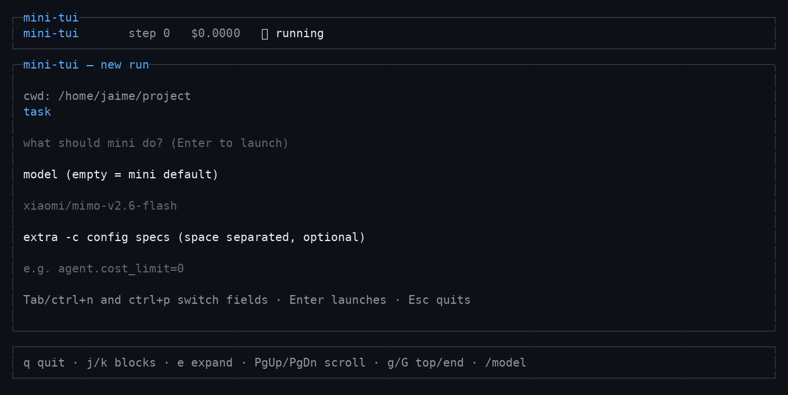

# mini-tui

A pretty terminal UI for [mini-swe-agent](https://github.com/SWE-agent/mini-swe-agent), built with
[OpenTUI](https://opentui.com) (React + Bun).

It only **parses and reformats** what `mini` already produces — tool calls (bash commands) and their
outputs — into cards, badges and banners. The harness runs completely untouched: mini-tui spawns
`mini` as a subprocess and reads the trajectory JSON it rewrites after every step.


## Features

- **Tool call cards** with syntax-highlighted bash commands and a focused-block indicator.
- **Output cards** with `rc=0` / `rc=N` badges, exception info, and collapsible bodies
  (`… 220 lines hidden · [e] expand`) so huge outputs never blow up the layout.
- **Live header** with model, step count, running cost and a spinner while a step is in flight.
- **`/model` — switch models mid-conversation.** Type `/model` to open the model picker (or
  `/model <id>` to jump straight to one). During a live run the agent picks the new model up from
  its next step — no restart, no lost context.

  

- **Plain-text final answers** (with the companion patch below): the agent finishes by simply
  answering instead of shuttling its answer through a temporary markdown file. The answer lands in
  the green `exit` banner.

  

- **`view` mode** renders any existing trajectory (including
  `~/.config/mini-swe-agent/last_mini_run.traj.json`) with the same renderer.

## Requirements

- [Bun](https://bun.sh) ≥ 1.3 (OpenTUI ships a native Zig renderer; Node ≥ 26.4 also works)
- `mini` on your `PATH`, configured as usual (your `~/.config/mini-swe-agent/.env` is honored)

## Install

```bash
git clone https://github.com/jaivial/mini-tui && cd mini-tui
bun install

# optional: make `mini-tui` available everywhere
cp bin/mini-tui ~/.local/bin/mini-tui && chmod +x ~/.local/bin/mini-tui
```

## Usage

```bash
# Launch a run (yolo) and watch it live
mini-tui run "Fix the failing test in test_utils.py" -m xiaomi/mimo-v2.6-flash

# Without a positional task you get a start screen (task / model / extra -c specs)
mini-tui run

# Render an existing trajectory (add --follow to keep watching it)
mini-tui view ~/.config/mini-swe-agent/last_mini_run.traj.json

# Include the system prompt in the transcript
mini-tui run ... --show-system
```

The start screen:



Run artifacts live under `~/.config/mini-tui/runs/<timestamp>-<slug>/`
(`traj.json`, `mini.log`, `pid`, `control`). mini-tui never touches
`~/.config/mini-swe-agent/last_mini_run.traj.json` — it always passes its own `-o`.

## Keys

| Key | Action |
| --- | --- |
| `q` | quit (SIGTERM to `mini`, then SIGKILL after 5 s) |
| `/model` | open the model picker (or type `/model <id>`) |
| `j` / `k` (or ↓ / ↑) | move between tool call blocks |
| `e` | expand / collapse the focused output block |
| `PgUp` / `PgDn` | scroll |
| `g` / `G` | top / bottom |
| `Esc` | cancel the picker / clear the command line |

On the start screen: `Tab` / `ctrl+n` / `ctrl+p` switch fields, `Enter` launches, `Esc` quits.

## How it works

```
mini-tui run
  ├─ src/mini/spawn.ts   spawns: mini -y --exit-immediately -o <session>/traj.json -m <model> -t <task>
  │                      raw stdout/stderr → <session>/mini.log
  ├─ src/traj/watch.ts   polls <session>/traj.json every 200 ms (rewritten by the harness per step)
  ├─ src/traj/parse.ts   pure parser: messages → RunEvent[] (tools, outputs, notices, exit)
  └─ src/ui/             OpenTUI + React renderer (cards, badges, banners, /model picker)
```

The parser tolerates mid-write reads (the harness rewrites the file non-atomically after every
step), unknown message shapes, and multimodal content in any of the message formats mini produces.

### `/model` under the hood

mini-tui writes `MODEL <id>` to the run's control file (`<session>/control`, exported to `mini` as
`MSWEA_CONTROL_FILE`). The companion harness patch makes the agent read that file before each model
call, so a switch applies from the next step, mid-run.

## Companion mini-swe-agent patches (optional)

Two small patches to your local mini-swe-agent unlock the nicest behaviors. Everything works without
them except live `/model` switching and plain-text final answers. See
[docs/mini-swe-agent-patches.md](docs/mini-swe-agent-patches.md) for the exact changes:

1. **Plain-text final answer** — a response with text and no tool calls is the submission
   (no more `cat > /tmp/final_answer.md` round-trips).
2. **Control file** — `MSWEA_CONTROL_FILE` with a `MODEL <id>` line switches the running agent's
   model from its next step (no-op when the variable is unset).

## Development

```bash
bun test          # parser fixtures + in-memory render tests (no TTY, no network)
bun run typecheck
bun run screenshots   # regenerates docs/screenshots/*.png from scripted scenes
```

## Notes and known limits

- Yolo only: runs use `mini -y --exit-immediately` — the UI visualizes, it never steers or confirms.
- No token streaming: the trajectory updates once per step, so the spinner covers model calls and
  command execution.
- The code highlighter degrades to plain text when a tree-sitter grammar is unavailable.
- If the TUI is killed hard, the `mini` child may survive: check `<session>/pid` and
  `pgrep -af "mini -y --exit-immediately"`.
