# mini-tui

A pretty terminal UI for [mini-swe-agent](https://github.com/SWE-agent/mini-swe-agent), built with
[OpenTUI](https://opentui.com) (React + Bun).

It only **parses and reformats** what `mini` already produces — tool calls (bash commands) and their
outputs — into cards, badges and banners. The harness runs completely untouched: mini-tui spawns
`mini` as a subprocess and reads the trajectory JSON it rewrites after every step.

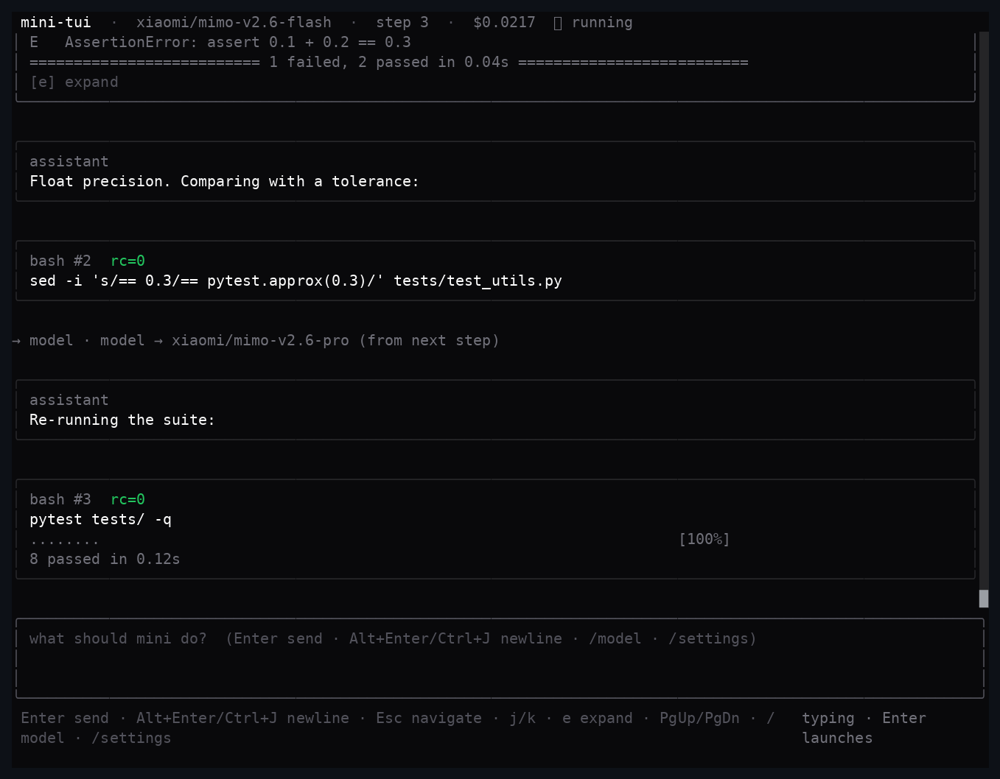

## Features

- **Prompt bar, Claude-Code style.** A compact multi-line prompt pinned to the bottom of the
  screen — long lines wrap to the next row and the box grows with your text (up to 8 rows):
  type your task (`Alt+Enter` / `Ctrl+J` for a hard new line), hit Enter, and keep typing
  follow-ups while the agent works (or after it submits) — they continue the *same* conversation.

  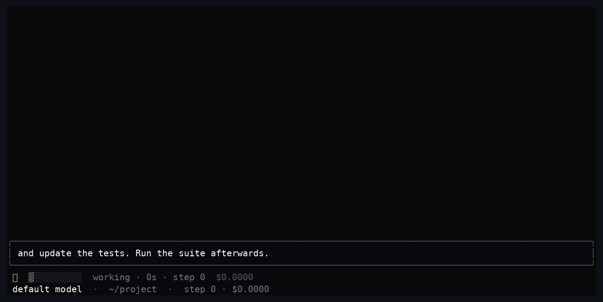

- **Command palette.** Typing `/` opens real-time completion over the available commands
  (`/model`, `/settings`, `/model <id>`): filter as you write, pick with `↑`/`↓` or a mouse click,
  fill into the prompt with `Enter`/`Tab` (it never sends for you).

  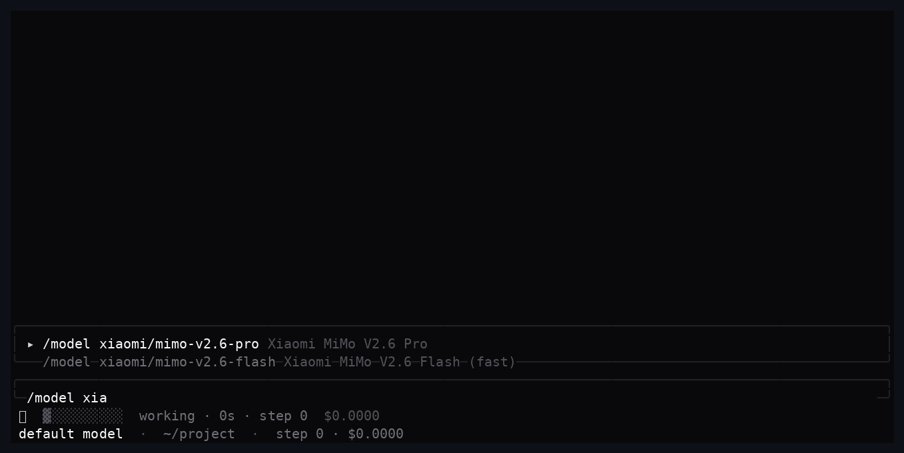

- **`$skill` — Claude Code skills in the prompt.** Typing `$` completes over the skills in
  `~/.claude/skills/<name>/SKILL.md` (override with `MINITUI_SKILLS_DIR`). Sending
  `$good-code tidy the parser` hands mini the skill's full instructions followed by your
  request; the transcript shows just `$good-code tidy the parser`.

- **Only what you sent.** The transcript shows your prompt as typed — never the harness' task
  template wrapping — the **final answer is rendered as proper markdown** (bold, code, links), and
  the redundant `exit Submitted` echo of it is never shown.
- **One quiet card per bash step** (command + its output), shadcn-style: zinc neutrals, rounded
  surfaces, a single subtle accent and semantic colors used sparingly. A single status line
  under the prompt carries everything: the animated load state while the agent works
  (`⣾ ▓░░░░ working · 34s`), the selected model, the working path and the checked-out git branch.
  Nothing sits below it.
- **Output display modes** — collapsed (just a `1 tool call` line), trimmed to 2 lines, or fully
  expanded. Pick one in the **settings panel** (`/settings`); it persists across runs. `e` still
  expands or collapses any block individually. Expanded output is capped at 500 lines with a
  `... N lines hidden ...` marker.
- **Flat memory, always.** The transcript is mounted in a sliding window (120 blocks; `g` pages
  older ones in, `G` returns to the live bottom) and every text block is clipped, so an all-day
  run keeps a flat footprint instead of growing with the conversation.
- **Six themes** — `shadcn` (zinc, default) plus `nord`, `dracula`, `gruvbox`, `tokyo night` and
  `catppuccin`. Also in `/settings` (`Tab` switches group): moving the selection repaints the
  whole UI live and the choice persists.

  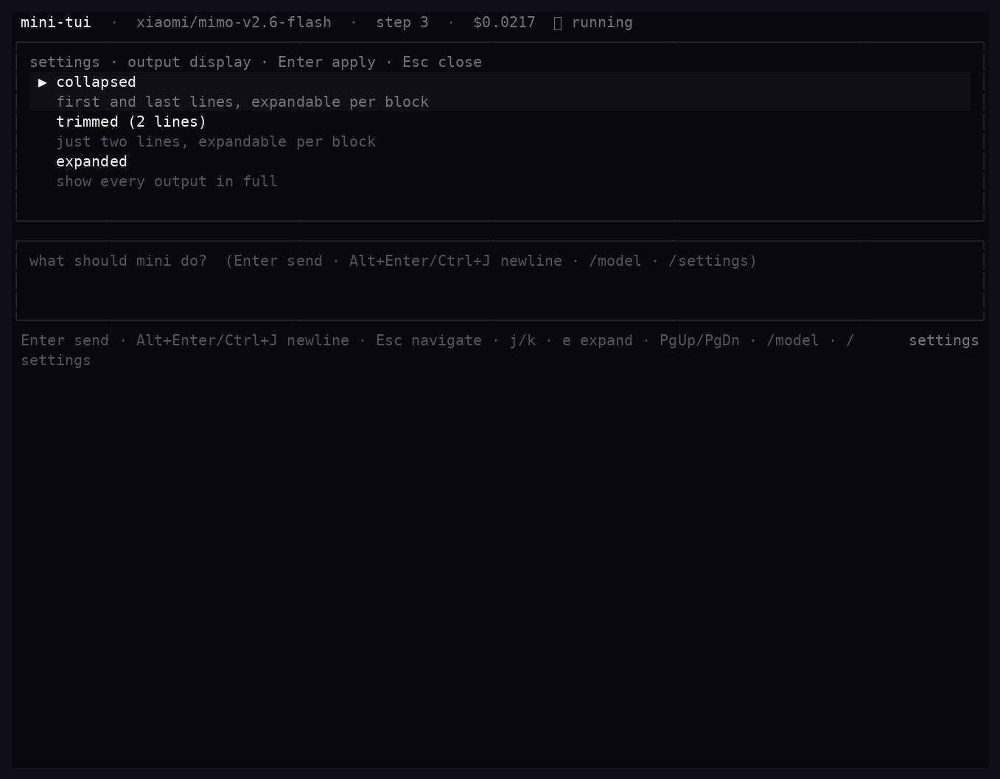

- **`/resume` — saved sessions in SQLite.** Every conversation is stored
  (`~/.config/mini-tui/sessions.db`) with an AI-generated title (falling back to your prompt,
  trimmed). `/resume` opens a modal listing the sessions **started in the current folder**,
  paged and searchable by title — pick one to restore its transcript, and your next prompt
  continues the *same conversation with full context* (`mini --resume`, companion patch 3).

  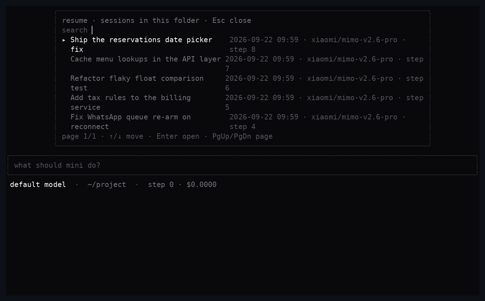

- **`/connect` — BYOK providers.** The whole MiniMax Code catalog — **Xiaomi MiMo, DeepSeek,
  OpenCode Go, Z.AI (GLM coding), MiniMax** — plus OpenAI, Anthropic, Moonshot, Zhipu, Groq and
  OpenRouter. Pick a provider, paste your API key, choose a model and the connection is
  **tested for real** (a one-token query through mini's own litellm-based model layer) before
  being saved locally. Every catalog model of a connected provider joins the `/model` picker,
  and its key is injected into your runs. All providers go through **litellm**: native prefixes
  (`xiaomi/…`, `deepseek/…`, `anthropic/…`, …) or litellm's `openai/` provider with
  `OPENAI_API_BASE`/`OPENAI_API_KEY` for any OpenAI-compatible endpoint (Z.AI, MiniMax, …).

  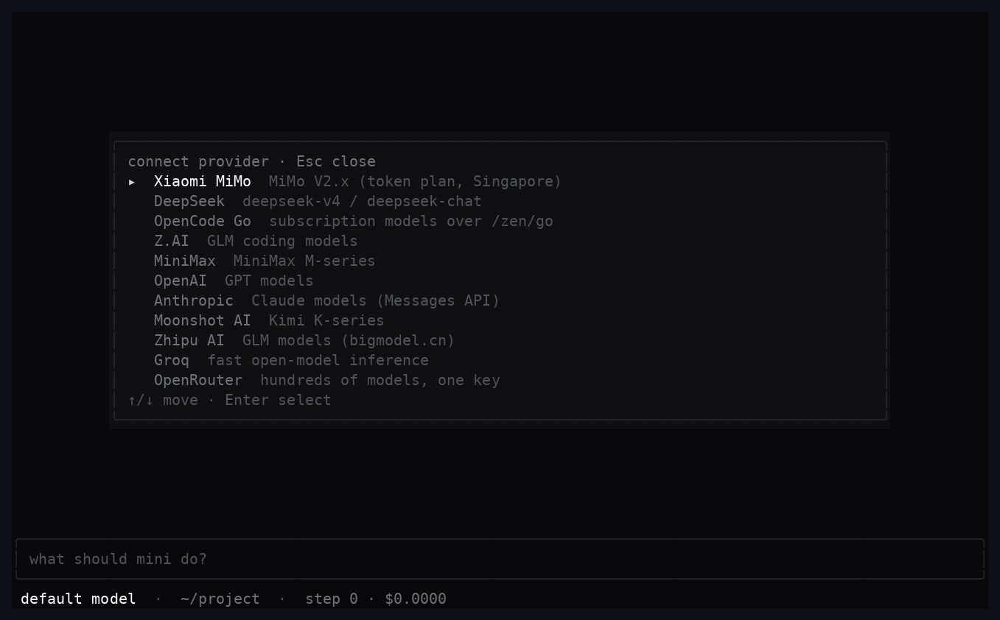

- **Select-to-copy.** Highlight any text in the UI with the mouse and it lands on your clipboard
  the moment you release — transcripts, commands, outputs, whatever. It works **inside tmux**
  (OSC 52 passthrough + the tmux paste buffer, `prefix+]`) and falls back to `wl-copy`/`xclip`/
  `xsel`/`pbcopy` when available.

- **Modals, not layout shifts.** `/model`, `/settings`, `/resume`, `/connect` and `/help` open as
  floating modals centered over the transcript — the prompt bar and the bottom stack never move,
  and panels clip to the available area on short terminals.

- **`/help`** lists every command and key in one panel.

  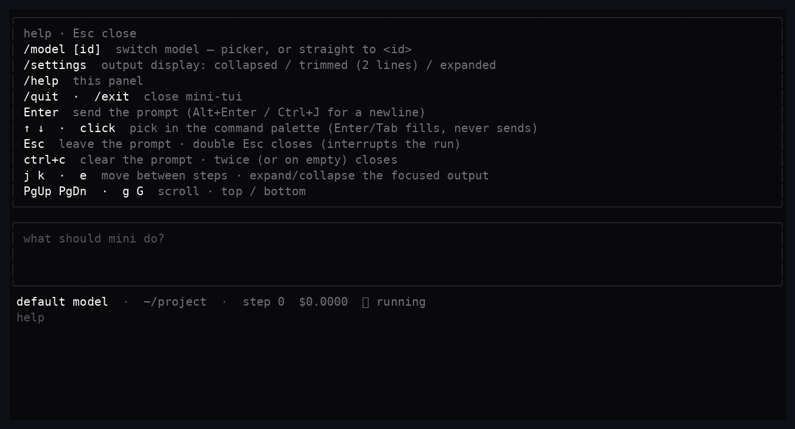

- **Tool call cards** with syntax-highlighted bash commands and a quiet focus marker.
- **Output cards** with `rc=0` / `rc=N` badges, exception info, and collapsible bodies
  (`… 220 lines hidden · [e] expand`) so huge outputs never blow up the layout.- **Live header** with model, step count, running cost and a spinner while a step is in flight.
- **`/model` — switch models mid-conversation.** Type `/model` in the prompt to open the model
  picker (or `/model <id>` to jump straight to one). During a live run the agent picks the new
  model up from its next step — no restart, no lost context.

  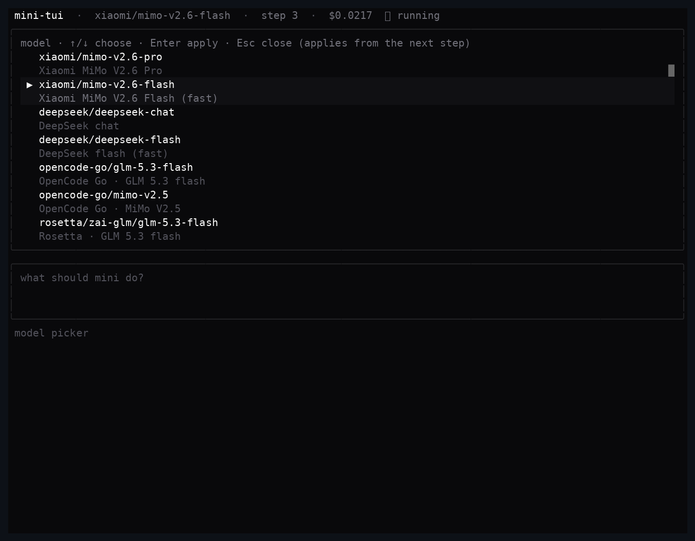

- **Plain-text final answers** (with the companion patch below): the agent finishes by simply
  answering instead of shuttling its answer through a temporary markdown file. The answer lands in
  the green `exit` banner, and you can type a follow-up to keep going.

  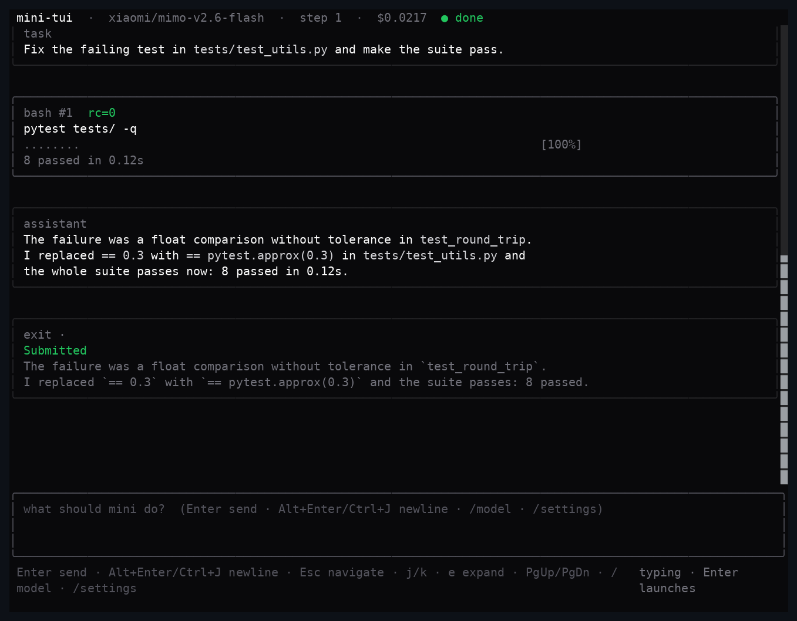

- **`view` mode** renders any existing trajectory (including
  `~/.config/mini-swe-agent/last_mini_run.traj.json`) with the same renderer.

## Themes

Six palettes — pick one in `/settings` (`Tab` to the theme group): moving the selection repaints
the whole UI live and the choice persists.

| shadcn (default) | nord | dracula |
| --- | --- | --- |
| 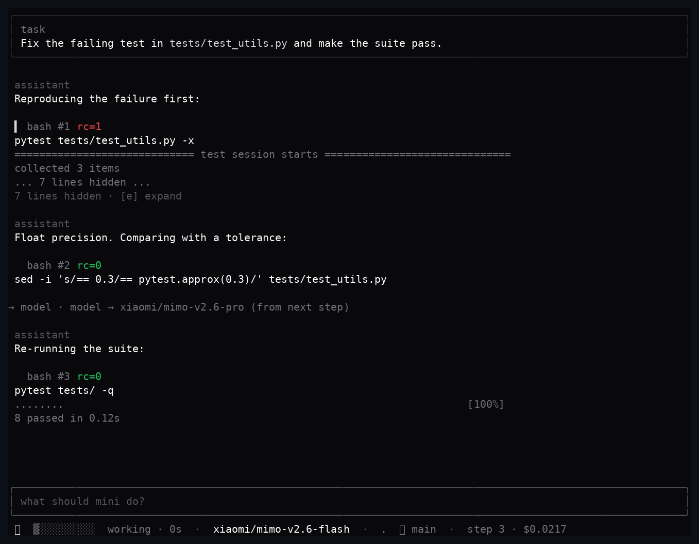 | 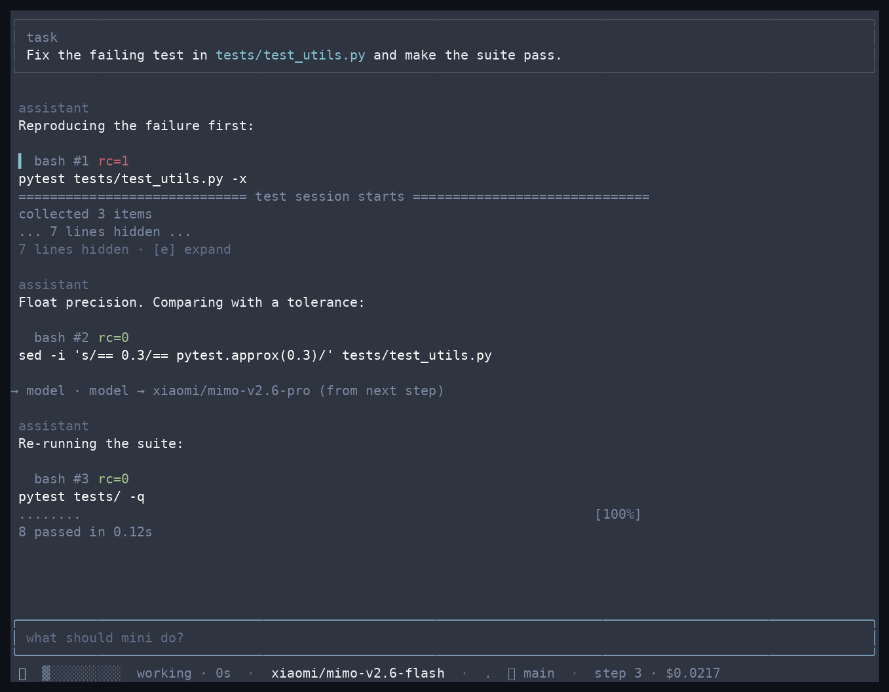 | 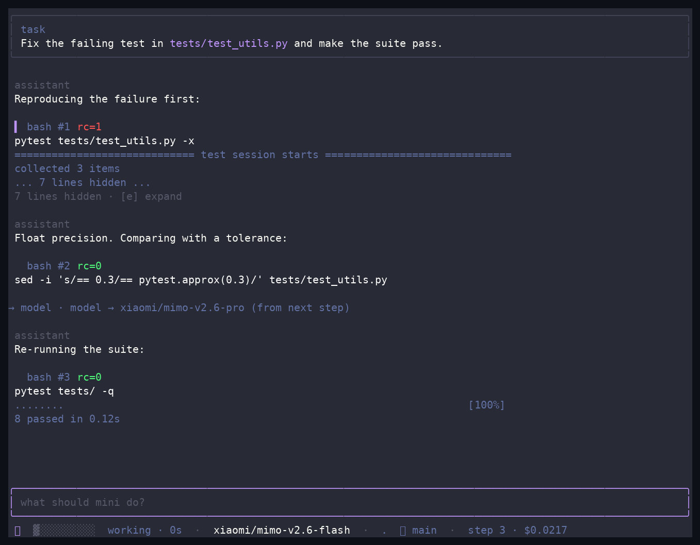 |

| gruvbox | tokyo night | catppuccin |
| --- | --- | --- |
| 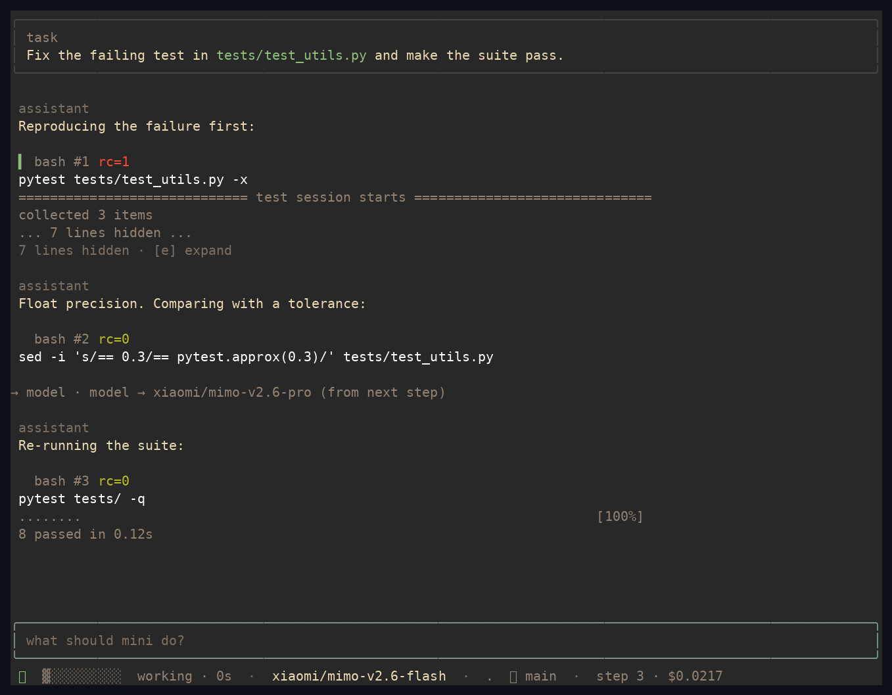 | 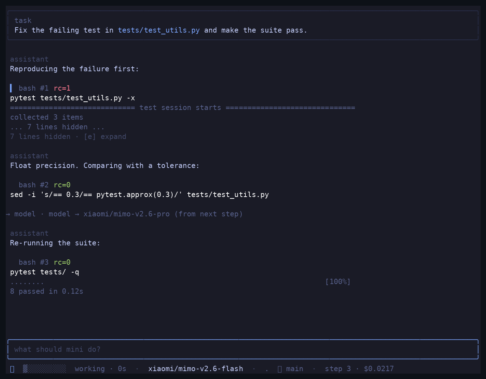 | 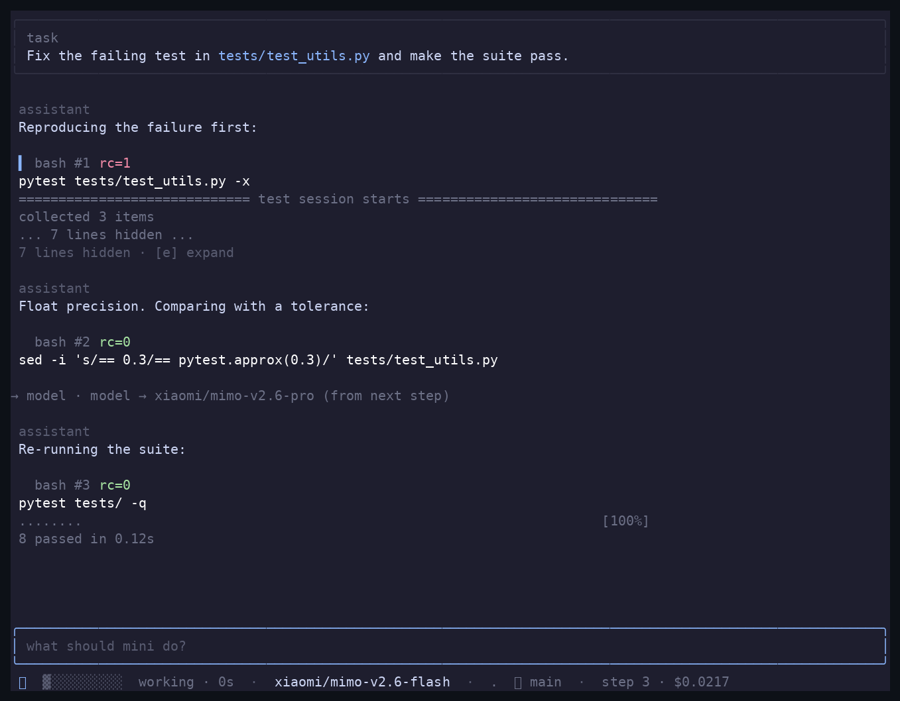 |

## Requirements

- [Bun](https://bun.sh) ≥ 1.3 (OpenTUI ships a native Zig renderer; Node ≥ 26.4 also works)
- Python ≥ 3.10 with the bundled agent installed (`pip install -e ./agent`) — or any `mini` on
  your `PATH`; your `~/.config/mini-swe-agent/.env` is honored either way

## Install

```bash
git clone https://github.com/jaivial/mini-tui && cd mini-tui
bun install
python3 -m pip install -e ./agent   # the bundled mini-swe-agent → `mini` on your PATH

# optional: make `mini-tui` available everywhere
cp bin/mini-tui ~/.local/bin/mini-tui && chmod +x ~/.local/bin/mini-tui
```

## Usage

```bash
# Just start it: the prompt bar is ready (like `mini -y -m <model>`, but pretty)
mini-tui
mini-tui -m xiaomi/mimo-v2.6-flash

# Or start immediately with a task
mini-tui run "Fix the failing test in test_utils.py" -m xiaomi/mimo-v2.6-flash

# Render an existing trajectory (add --follow to keep watching it)
mini-tui view ~/.config/mini-swe-agent/last_mini_run.traj.json

# Include the system prompt in the transcript
mini-tui run ... --show-system
```

Run artifacts live under `~/.config/mini-tui/runs/<timestamp>-<slug>/`
(`traj.json` + its append-only `traj.jsonl` journal, `mini.log`, `pid`, `control`). mini-tui never
touches `~/.config/mini-swe-agent/last_mini_run.traj.json` — it always passes its own `-o`.

## Keys

| Key | Action |
| --- | --- |
| `Enter` | send the prompt (starts a task, or continues the running conversation) |
| `Alt+Enter` / `Ctrl+J` | insert a newline in the prompt (`Shift+Enter` too where the terminal reports it) |
| `/` | opens the command palette: `↑`/`↓` or click to select · `Enter`/`Tab` fills the prompt (never sends) |
| `$` | opens the skills palette (`~/.claude/skills`) · `$<skill> <request>` runs the request with that skill |
| `↑` / `↓` (in the prompt) | browse the prompts sent in this session · `↓` past the newest restores your draft |
| `Esc` | close the palette / leave the prompt · **double `Esc` interrupts the run** |
| `ctrl+c` | clear the prompt · press it twice (within 1.5 s) to close |
| `/quit` · `/exit` | close mini-tui |
| `/help` | commands and keys |
| `/model` | open the model picker (or `/model <id>` for a direct switch) |
| `/settings` | output display (collapsed / trimmed / expanded) |
| `/new` | start a fresh session in place (stops the current run; model and settings stay) |
| `/resume` | browse sessions saved in this folder (search + pages) |
| `/connect` | connect a BYOK provider (key → model → tested connection) |
| `j` / `k` (or ↓ / ↑) | (navigation mode) move between tool call blocks |
| `e` | expand / collapse the focused output block |
| `PgUp` / `PgDn` | scroll half a screen · mouse wheel scrolls 3–5× (burst-accelerated) |
| `g` / `G` | load older steps (pages of 120) / back to the live bottom |

## How it works

```
mini-tui run
  ├─ src/mini/spawn.ts   spawns: mini -y --exit-immediately -o <session>/traj.json -m <model> -t <task>
  │                      raw stdout/stderr → <session>/mini.log
  ├─ src/traj/watch.ts   polls <session>/traj.json every 200 ms (rewritten by the harness per step)
  ├─ src/traj/parse.ts   pure parser: messages → RunEvent[] (tools, outputs, notices, exit)
  └─ src/ui/             OpenTUI + React renderer (cards, badges, banners, prompt, /model picker)
```

The parser tolerates mid-write reads (the harness rewrites the file non-atomically after every
step), unknown message shapes, and multimodal content in any of the message formats mini produces.

### Follow-ups and `/model` under the hood

mini-tui appends `MESSAGE <text>` / `MODEL <id>` lines to the run's control file
(`<session>/control`, exported to `mini` as `MSWEA_CONTROL_FILE`). The companion harness patch:

- injects `MESSAGE` lines as `UserNewTask` prompts — from the agent's next step mid-run, and after
  a submission via an *exit hold* (the run stays open so one conversation can span many turns);
- applies `MODEL` switches from the next step.

## Bundled mini-swe-agent

`agent/` vendors [mini-swe-agent](https://github.com/SWE-agent/mini-swe-agent) (v2.4.6 base via
`git subtree --squash`) together with everything mini-tui's nicest behaviors need, so
`pip install -e ./agent` is one install that carries:

1. **Plain-text final answer** — a response with text and no tool calls is the submission
   (no more `cat > /tmp/final_answer.md` round-trips).
2. **Control file** — `MODEL <id>` switches the running agent's model from its next step;
   `MESSAGE <text>` continues the conversation mid-run or at the exit hold (both no-ops when
   `MSWEA_CONTROL_FILE` is unset).
3. **`--resume`** — reloads a previous conversation's message history as context and treats
   the new task as a follow-up (what `/resume` + prompt uses).
4. **Custom model providers** — xiaomi (MiMo), rosetta, cliproxy, deepseek, opencode_go and
   openai model classes, with `mini extra <provider>-models` to list their catalogs.
5. **Append-only trajectory journal** — `<traj>.jsonl` gets one line per message (O(1) per
   step, never torn) and the full `traj.json` export is compact, atomic and throttled;
   mini-tui reads the journal and parses only the new bytes per tick.

Upstream sync: `git subtree pull --prefix=agent --squash <upstream> <ref>`. The original patch
descriptions (kept for upstreaming) live in
[docs/mini-swe-agent-patches.md](docs/mini-swe-agent-patches.md).

## Performance

Trajectory persistence, measured on a synthetic 300-step run (the agent saves after every step):

| | full rewrite per step (old) | append-only journal + throttled export (now) |
| --- | --- | --- |
| Bytes written | 235.4 MB | 4.3 MB (**55× less**) |
| Persistence time | 0.99 s | 0.12 s (**8× faster**) |

The TUI itself is bounded and lean: the transcript mounts in a sliding window of 120 blocks, so
memory stays flat no matter how long a run gets (this fixed a 5+ GB growth on long runs in
0.2.0). The 0.3.0 render pass then cut the measured footprint by ~30 % across the board — on the
standard 400-step repro: 18.6 s → 13.1 s CPU and peak RSS 323 → 228 MB. In 0.5.0 blocks got
3.6× leaner (plain text unless the text really has markdown — measured 0.33 → 0.09 MB per
block): the same repro now settles at 205 MB, and a plain-prose run at 152 MB. Agent-side,
`prompt_toolkit` loads lazily (35 → 20 MB import). In 0.7.0 the local/subscription gateways
(`cliproxy/`, `rosetta/`, `xiaomi/`) talk to their OpenAI-compatible endpoint directly instead of
through `litellm`: a real claude-opus-5-5 run peaks at **40 MB instead of 214 MB** and answers
~2.3 s sooner. See [docs/PLAN-ram-reduction.md](docs/PLAN-ram-reduction.md) for the plan and numbers.

## Development

```bash
bun test          # parser fixtures + in-memory OpenTUI render tests (no TTY, no network)
bun run typecheck
bun run screenshots   # regenerates docs/screenshots/*.png from scripted scenes
```

## Notes and known limits

- Yolo only: runs use `mini -y --exit-immediately` — the UI visualizes and forwards prompts, it
  never confirms or rejects commands.
- No token streaming: the trajectory updates once per step, so the spinner covers model calls and
  command execution. Follow-ups sent mid-step are picked up at the next step.
- After a submission the run stays open ("type to continue") while the TUI is attached; quitting
  the TUI ends it.
- The code highlighter degrades to plain text when a tree-sitter grammar is unavailable.
- If the TUI is killed hard, the `mini` child may survive: check `<session>/pid` and
  `pgrep -af "mini -y --exit-immediately"`.
