# mini-tui

A pretty terminal UI for [mini-swe-agent](https://github.com/SWE-agent/mini-swe-agent), built with
[OpenTUI](https://opentui.com) (React + Bun).

It **integrates the bundled mini-swe-agent directly** for normal yolo runs: the TUI launches the
agent's lightweight `mini-swe-agent-tui` entry point, owns the terminal UI, and reads the same
append-only trajectory journal/control file as before. The public `mini` CLI remains supported and
is used automatically for older or custom agents. The harness still produces the same messages and
artifacts, so the integration is observable and reversible.

Three ways to use it:
- **Terminal UI** (`mini-tui`), described below.
- **[Web app](#web-app)** (`bun run web`): panes, notes, a terminal, and sessions on remote hosts.
- **[Headless](#headless-mini-tui--p-no-tui)** (`mini-tui -p`), for scripts and CI.

The agent behind all three is the bundled Python mini-swe-agent, or its
**[Rust port](#the-rust-agent-optional)**. The Rust port is a single binary that needs no Python.

The terminal UI and the web app share one session history **and one live agent per session**: open
a session in both and they stream the same run, and a prompt typed in either reaches the same agent.
With the Rust agent, a session can also **[start subagents](#subagents)** of its own and see them
report back.

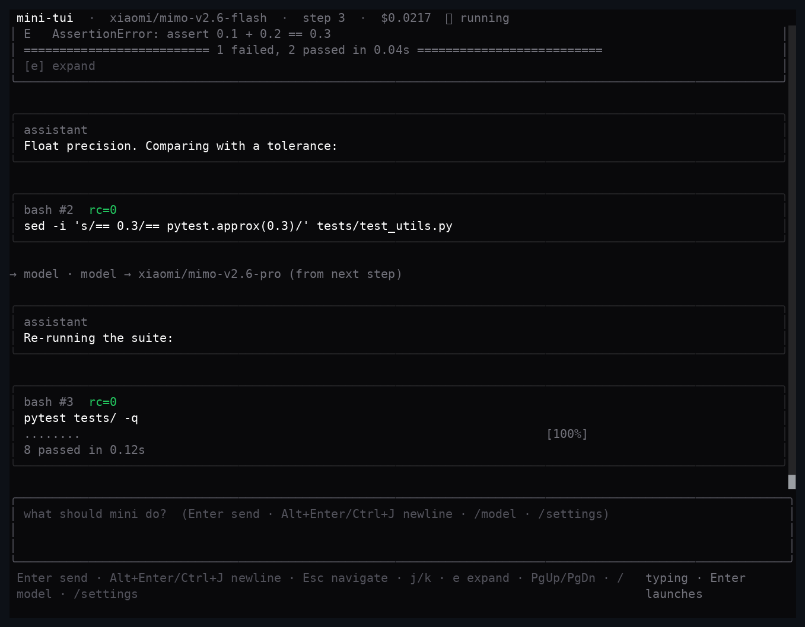

## Features

- **Prompt bar, Claude-Code style.** A compact multi-line prompt pinned to the bottom of the
  screen — long lines wrap to the next row and the box grows with your text (up to 8 rows):
  type your task (`Alt+Enter` / `Ctrl+J` for a hard new line), hit Enter, and keep typing
  follow-ups while the agent works (or after it submits) — they continue the *same* conversation.

  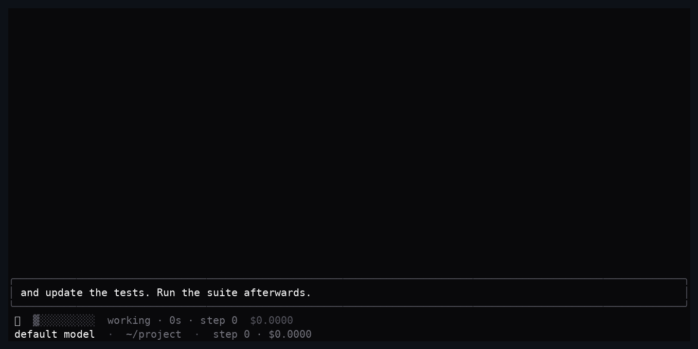

- **Command palette.** Typing `/` opens real-time completion over the available commands
  (`/model`, `/settings`, `/model <id>`): filter as you write, pick with `↑`/`↓` or a mouse click,
  fill into the prompt with `Enter`/`Tab` (it never sends for you).

  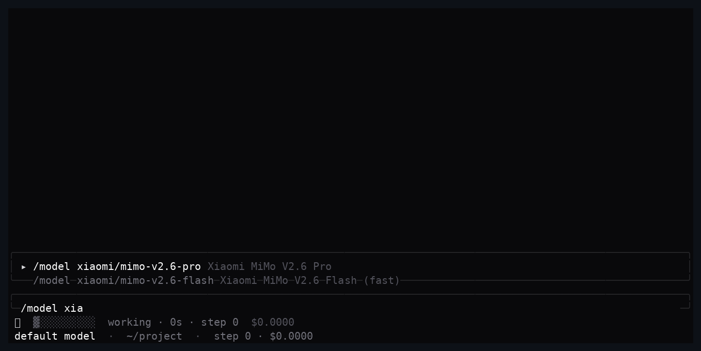

- **`$skill` — skills anywhere in the prompt.** Type `$` at any point of the phrase and a
  panel lists the skills, filtering as you type on any word of the name, in any order (`$body` and
  `$body-pr` find `pr-body`); `Enter`/`Tab` inserts `$name`, painted in the
  skill color. A prompt like `follow $good-code, then use $better-ui, $pr-body, and finish with
  $pr-fix-loop` hands mini every referenced skill's instructions, then your prompt verbatim;
  the transcript shows just what you typed. Unknown `$names` stay plain text.
- **Skills inherited from Claude Code.** mini-tui keeps its own folder,
  `~/.config/mini-tui/skills/` (override with `MINITUI_SKILLS_DIR`). At install (`bun install`
  runs the sync) and at every startup, each skill in `~/.claude/skills` that folder doesn't have
  yet is copied in, including symlinked skills and the `synced/<bucket>/` layout. Copies are
  never overwritten, and a skill you delete from mini-tui's folder is not re-imported.
  `bun run sync-skills` runs the sync by hand.
- **Bundled skills, carried everywhere.** mini-tui ships its own skills in `skills/`:
  **`$e2e`** (how agents write and run `mini-agent-rs e2e` tests), **`$e2e-army`** (how agents
  write and run TesterArmy [`e2e`](https://e2e.tester.army/docs) tests, `npx e2e` with
  `e2e.config.ts`, whose agent steps run on MiniMax `MiniMax-M3.1-Flash-Preview` with the key from
  `~/.env`) and **`$subagents`** (how an agent splits work across its own subagents). They are installed into
  the skills folder at install and at every startup of the TUI, `-p` and the web server; a newer
  bundled version replaces an unedited copy, while an edited or deleted one is left as you made
  it. `mini-agent-rs e2e skill` prints `$e2e` on hosts with only the binary.
- **The TUI and the web app on the same session.** Every UI records the agent it runs for a
  session. Opening that session elsewhere (the web app, another terminal) follows the same agent
  live instead of starting a second one: its output streams in as it is written, and a prompt,
  `/model` or `/compact` sent from either UI reaches it. Closing one view leaves the agent to the
  other. Sessions that a terminal continued while the web app held them are reloaded before the
  next message, so a conversation never forks.
- **Subagents (`/subagents`).** With the Rust agent, a session can split its work across child
  agents it owns ([details](#subagents)). `/subagents` lists them with their state, steps and
  cost; each one is saved as a session, so `/resume` opens it.
- **`/compact`.** Summarizes the conversation now, with or without a run in flight. While it
  runs, the transcript shows `Compacting...` and the status line `compacting`. Auto-compaction
  (at 80 % of the context window) shows the same state.

- **Only what you sent.** The transcript shows your prompt as typed — never the harness' task
  template wrapping — the **final answer is rendered as proper markdown** (bold, code, links), and
  the redundant `exit Submitted` echo of it is never shown.
- **One quiet card per bash step** (command + its output), shadcn-style: zinc neutrals, rounded
  surfaces, a single subtle accent and semantic colors used sparingly. A single status line
  under the prompt carries everything: the animated load state while the agent works
  (`⣾ ▓░░░░ working · 34s`), the selected model, the working path and the checked-out git branch.
  Nothing sits below it.
- **Output display modes** — collapsed (just a `1 tool call` line), trimmed to 2 lines, or fully
  expanded. The model's thinking follows the same three states (`Thinking...` while it works,
  `Thought for {n} seconds` when done), and your prompt is echoed into the thread the moment
  you send it. Pick one in the **settings panel** (`/settings`); it persists across runs. `e` still
  expands or collapses any block individually. Expanded output is capped at 500 lines with a
  `... N lines hidden ...` marker.
- **Flat memory, always.** The transcript is mounted in a viewport-sized sliding window
  (two viewports, 24–120 items depending on terminal height; `g` pages older ones in, `G` returns
  to the live bottom) and every text block is clipped, so an all-day run keeps a flat footprint
  instead of growing with the conversation.
- **Six themes** — `shadcn` (zinc, default) plus `nord`, `dracula`, `gruvbox`, `tokyo night` and
  `catppuccin`. Also in `/settings` (`Tab` switches group): moving the selection repaints the
  whole UI live and the choice persists.

  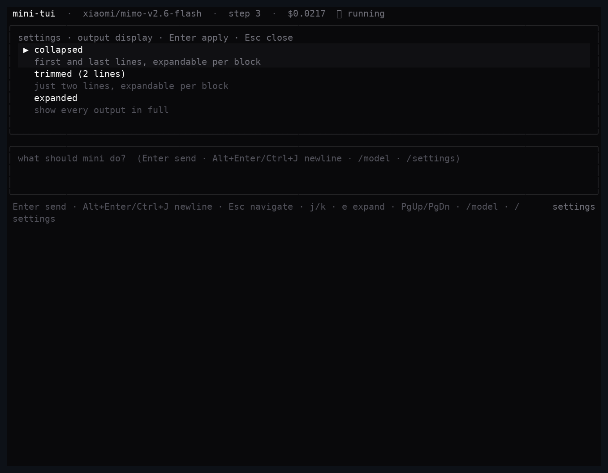

- **`/resume` — saved sessions in SQLite.** Every conversation is stored
  (`~/.config/mini-tui/sessions.db`) with an AI-generated title (falling back to your prompt,
  trimmed). `/resume` opens a modal listing the sessions **started in the current folder**,
  paged and searchable by title — pick one to restore its transcript, and your next prompt
  continues the *same conversation with full context* (`mini --resume`, companion patch 3).
  Not sure which one it was? `→` (or clicking `[→ preview]`) shows the selected session's
  transcript **read-only inside the same panel** — scroll it with `↑`/`↓`, `PgUp`/`PgDn`,
  `g`/`G`; `←`/`Esc` goes back to the list, `Enter` opens it.

  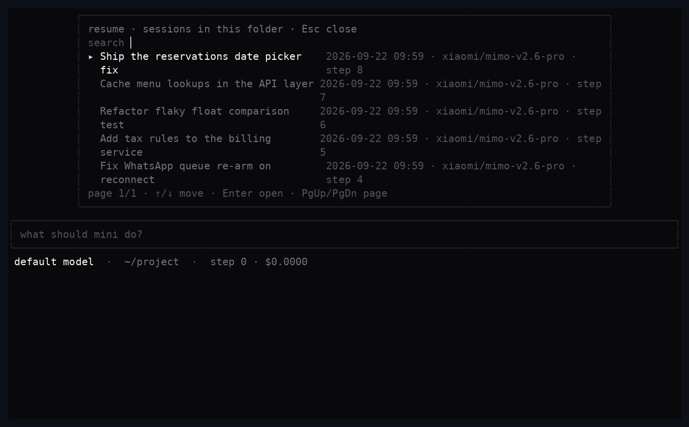

- **`/connect` — BYOK providers.** The whole MiniMax Code catalog — **Xiaomi MiMo, DeepSeek,
  OpenCode Go, Z.AI (GLM coding), MiniMax** — plus OpenAI, Anthropic, Moonshot, Zhipu, Groq and
  OpenRouter. Pick a provider, paste your API key, choose a model and the connection is
  **tested for real** (a one-token query through mini's own model layer) before
  being saved locally. Every catalog model of a connected provider joins the `/model` picker,
  and its key is injected into your runs, including runs the agent starts itself (subagents, a
  model switch mid-run). Every provider runs on **its own direct base URL**
  (`xiaomi/…`, `deepseek/…`, `anthropic/…`, …) with a dedicated key/base env slot — no
  litellm. Saved connections on the generic `openai/` slot (`OPENAI_API_BASE`/`OPENAI_API_KEY`)
  keep working for any OpenAI-compatible endpoint.

  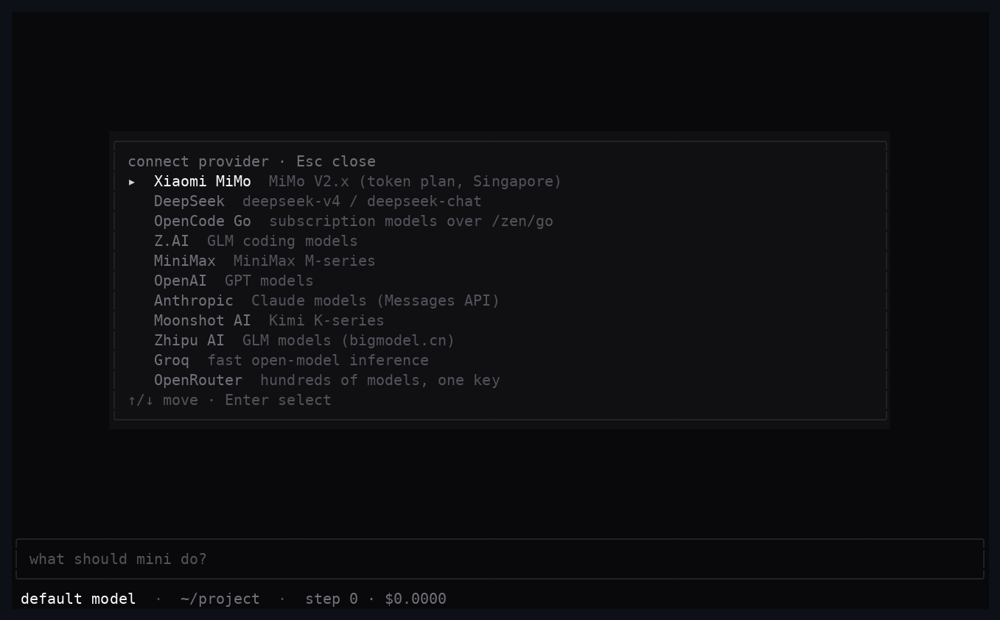

- **Select-to-copy.** Highlight any text in the UI with the mouse and it lands on your clipboard
  the moment you release — transcripts, commands, outputs, whatever. It works **inside tmux**
  (OSC 52 passthrough + the tmux paste buffer, `prefix+]`) and falls back to `wl-copy`/`xclip`/
  `xsel`/`pbcopy` when available.

- **Modals, not layout shifts.** `/model`, `/settings`, `/resume`, `/connect` and `/help` open as
  floating modals centered over the transcript — the prompt bar and the bottom stack never move,
  and panels clip to the available area on short terminals.

- **`/help`** lists every command and key in one panel.

  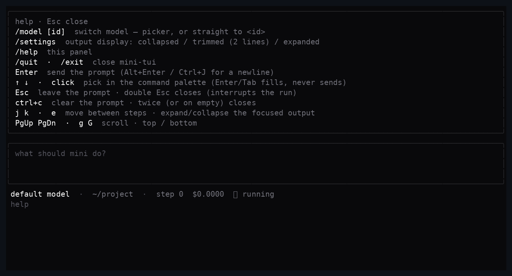

- **Tool call cards** with syntax-highlighted bash commands and a quiet focus marker.
- **Output cards** with `rc=0` / `rc=N` badges, exception info, and collapsible bodies
  (`… 220 lines hidden · [e] expand`) so huge outputs never blow up the layout.- **Live header** with model, step count, running cost and a spinner while a step is in flight.
- **`/model` — switch models mid-conversation.** Type `/model` in the prompt to open the model
  picker (or `/model <id>` to jump straight to one). During a live run the agent picks the new
  model up from its next step — no restart, no lost context. The last model you pick (in any
  session) is remembered in `~/.config/mini-tui/last-model.json` and becomes the default of
  **new** mini-tui terminals; windows that are already open keep their own model. `-m` and
  `$MINITUI_MODEL` still take precedence.

  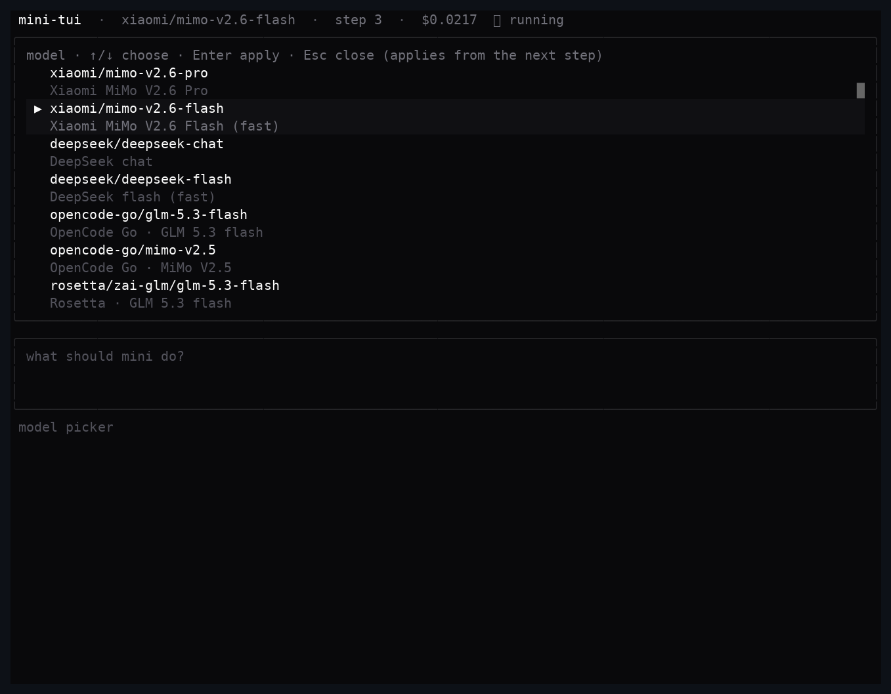

- **Agent commits are authored by you.** Runs export `GIT_AUTHOR_*` / `GIT_COMMITTER_*` from
  the account logged into `gh` (GitHub noreply email), falling back to `git config --global
  user.*` — commits never show up as "claude". `MINITUI_GIT_IDENTITY=0` disables it.

- **Plain-text final answers** (with the companion patch below): the agent finishes by simply
  answering instead of shuttling its answer through a temporary markdown file. The answer lands in
  the green `exit` banner, and you can type a follow-up to keep going.

  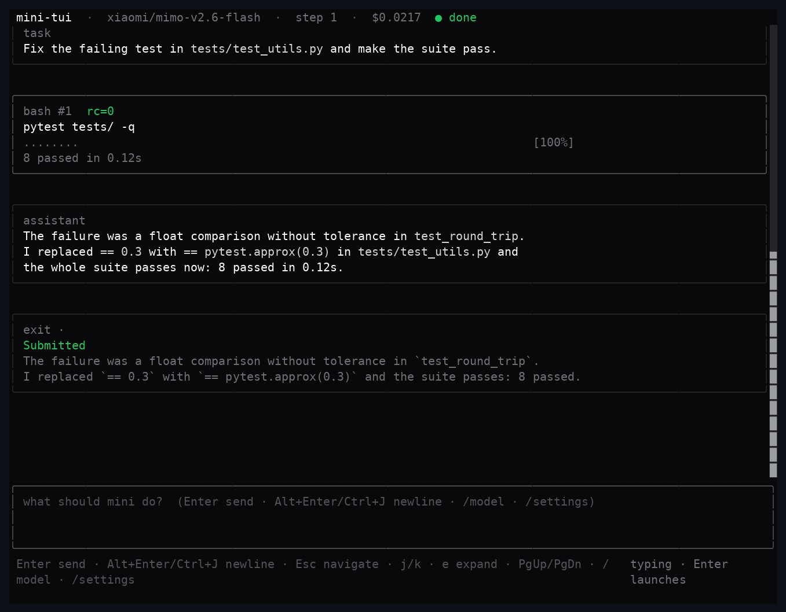

- **`view` mode** renders any existing trajectory (including
  `~/.config/mini-swe-agent/last_mini_run.traj.json`) with the same renderer.

## Web app

The same agent, in a browser, with **every session running at once in panes and windows**:

- split the screen like tmux, up to **12 panes in a window**;
- group panes into as many **windows** as you like, each with a working, done or idle dot per pane in the sidebar;
- move any pane to another window from its menu, **rearrange the panes** of a window (a menu step in
  each direction, a row / column / grid layout, or drag one onto another to swap them);
- **resize the notes** of a session freely inside its pane, the width kept per pane;
- keep the same layout on **every device** (it lives on the server).

Each session streams over **its own WebSocket**, and a remote mode keeps the agent **headless on a server
over SSH** while the UI stays on your machine.

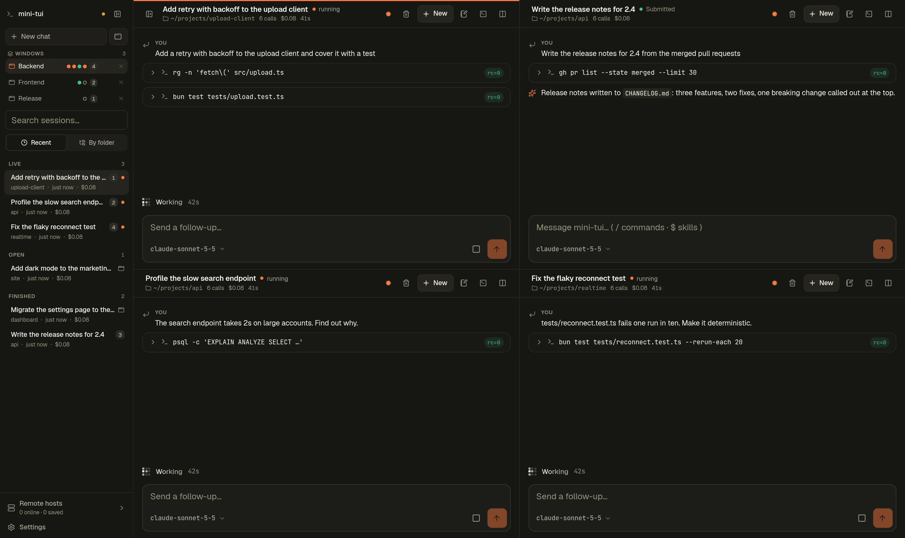

<table>
<tr>
<td width="72%">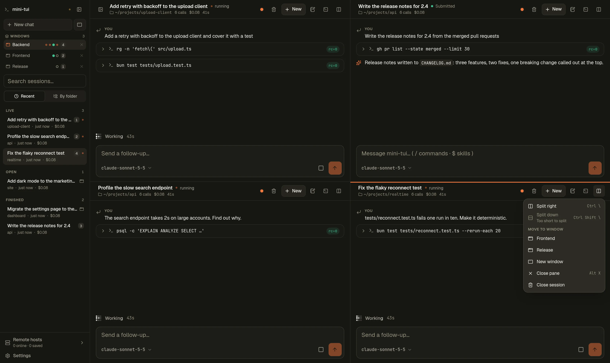</td>
<td width="28%">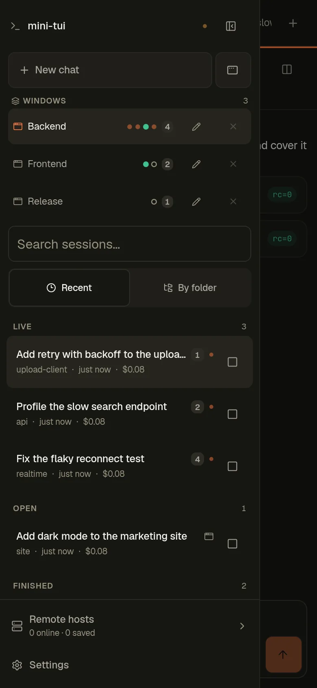</td>
</tr>
<tr>
<td>Move a pane to another window, or to a new one.</td>
<td>The same windows on a phone.</td>
</tr>
</table>

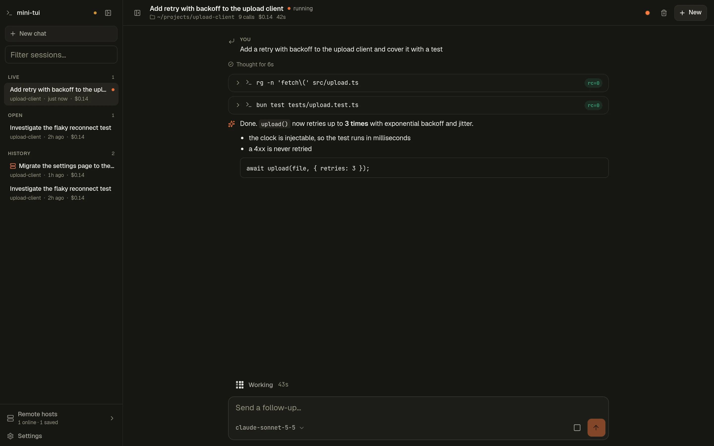

```bash
bun run web          # build the UI and serve everything on http://127.0.0.1:4317
bun run web:dev      # Vite dev server, hot reload
```

Sessions started in the browser land in the same `~/.config/mini-tui/sessions.db` the terminal UI's
`/resume` reads, so both front ends see each other. **A session running in a terminal opens live in
the browser**: the web app follows that terminal's agent (its output streams in, your prompts go to
it) instead of showing a frozen copy or starting a second agent, and the terminal does the same for
a session the browser runs. Opening a session never fails because a terminal is saving at that
moment: the database runs in WAL mode, so readers never wait for a writer. `/resume` works in the browser too, even from a new
chat with nothing running: it lists every saved session, searchable, and sending a message continues the
one you pick.

What the web app does:
- **History in the sidebar**, by recency or grouped **by folder**.
- **A folder picker** for new chats that also browses remote hosts.
- **Prompt memory** with `↑`/`↓`.
- **A toast when a session finishes**, with a **View** button that jumps to it.
- **Panes** like tmux (`Ctrl+\`), up to 12 in a **window**, and as many windows as you like: the sidebar
  lists them with a pane count and a **New window** button, and any pane can move to another window or to
  a new one from its pane menu.
- **A side panel in every pane**, with two tabs:
  - **Notes**, saved as you type.
  - **Terminal**, a real shell in the session's folder (over SSH for a remote session) that survives
    hiding the panel and reloading the page. Open it with `` Ctrl+` `` or `/terminal`.
- **Settings** with an **interface size** and a separate **text size**.
- **Subagents above the transcript.** A session whose agent started subagents shows them in a strip
  under its header, each with a status dot, its steps and its cost. Click one to follow it live in
  the pane (and message it like any session); its own strip links back to the parent.
  `/subagents [name]` lists them or opens one.

**One workspace on every device**: the windows, panes and sidebar are kept on the server, so a phone,
a laptop and a second tab all show the same thing, and a change on one appears on the others live.

Notes, the terminal, the shared workspace and prompt memory all travel over one hub WebSocket per tab,
with no REST polling. A server restart (a deploy) does not lose your panes: sessions reopen from the saved
history when the page reconnects.

The terminal is a shell as the user the server runs as, so keep the server behind authentication,
or turn the terminal off with `MINITUI_WEB_TERMINAL=0`. Remote runs need `mini-tui` on the server;
the hosts panel has a **Test** button that checks reachability and agent presence.

To run it as a service, [`deploy/mini-tui-web.service`](deploy/mini-tui-web.service) is a systemd
unit. Agents and the terminal can use `sudo` there just as in the terminal UI, limited by the account's
own sudoers rules. Do not add `NoNewPrivileges=true`: it makes every `sudo` fail.

<table>
<tr>
<td width="50%">

**A new chat is a draft.** `/new` shows an empty chat and creates nothing; the first message creates the
session on the model and host you picked.

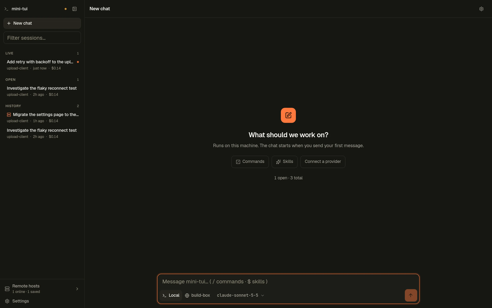

</td>
<td width="50%">

**Commands and skills.** `/` opens commands, `$` opens skills (the terminal's own matching). A pick becomes
a chip and is joined to your text only when you send.

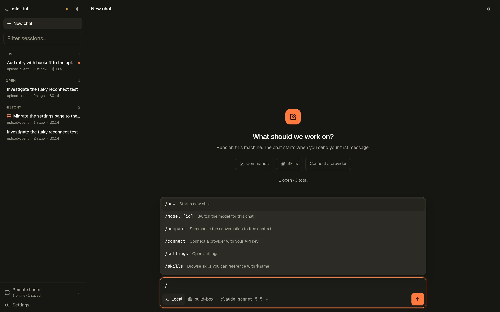

</td>
</tr>
<tr>
<td width="50%">

**Model switcher.** Searchable and grouped by provider, fully keyboard-driven, and it opens from the prompt
bar. A model missing from the list can be typed.

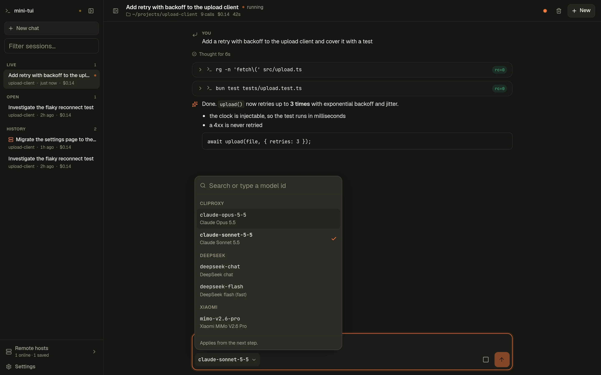

</td>
<td width="50%">

**Settings and providers.** Test a key with a real request before it is saved. Keys never come back out of
the server: reads carry a masked hint.

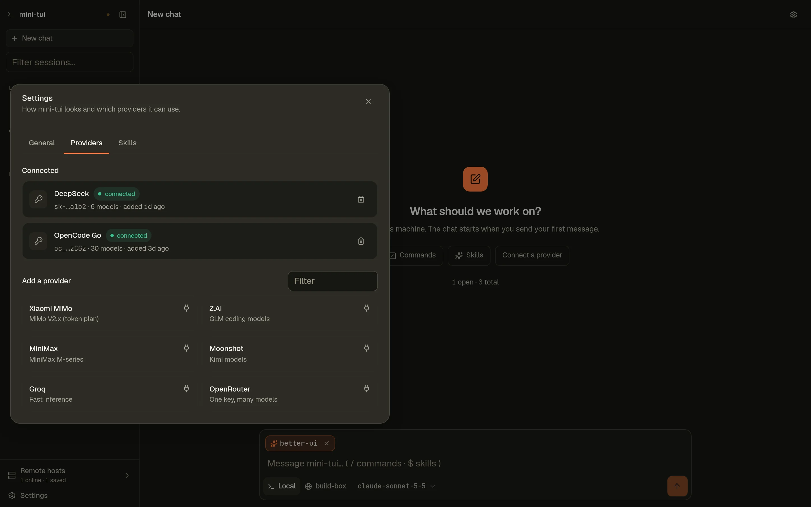

</td>
</tr>
</table>

The prompt bar is one line when empty and grows a line at a time up to five, then scrolls. Chips keep the
field a plain textarea, so IME, autocorrect and paste all keep working.

<table>
<tr>
<td width="50%">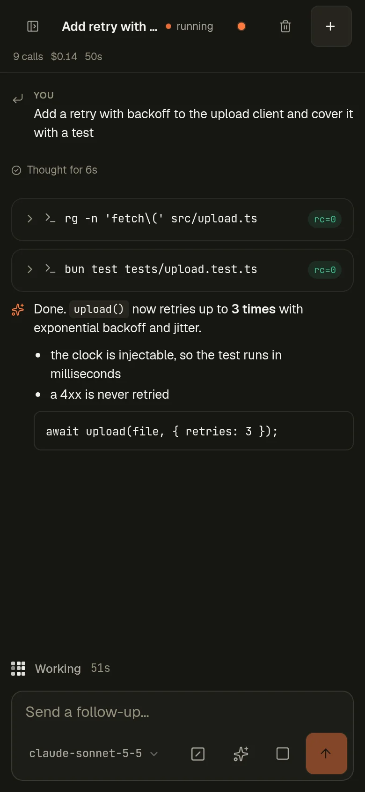</td>
<td width="50%">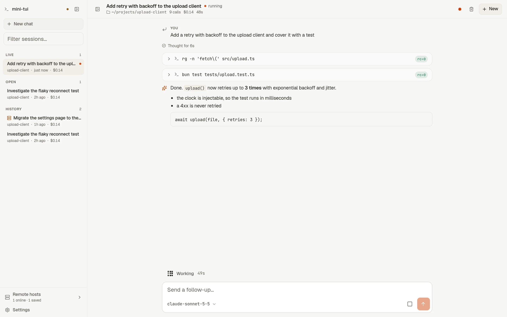</td>
</tr>
</table>

Built for touch as well as a keyboard: 44px targets on a finger, bottom-sheet dialogs, safe-area insets and
`dvh` layout. Light and dark, six accent palettes. Full details: [web/README.md](web/README.md).

## Landing page and docs

`site/` is the project's landing page and documentation: SvelteKit prerendered to static HTML (every route
is a real `.html` file, readable with JavaScript off), Tailwind 4 with shadcn-svelte components, and
scroll-reveal motion that only ever hides content it is about to animate in.

```bash
cd site && bun install
bun run dev         # http://127.0.0.1:4320
bun run build       # prerender every route to site/build
bun run seo         # audit the built pages: titles, descriptions, canonicals, JSON-LD, alt text, links, sitemap
bun run browse      # real-browser check at desktop / tablet / phone
bun run layout      # width audit: no sideways scroll, no squeezed column, at 320 to 1440 px
```

The canonical origin comes from `VITE_SITE_URL`, and the base path is derived from it, so links, canonical
tags and the sitemap cannot disagree. `.github/workflows/site.yml` runs the audits and publishes to GitHub
Pages on every push to `main` that touches the site. Docs are markdown in `site/src/content/docs/`.

## Themes

Six palettes — pick one in `/settings` (`Tab` to the theme group): moving the selection repaints
the whole UI live and the choice persists.

| shadcn (default) | nord | dracula |
| --- | --- | --- |
| 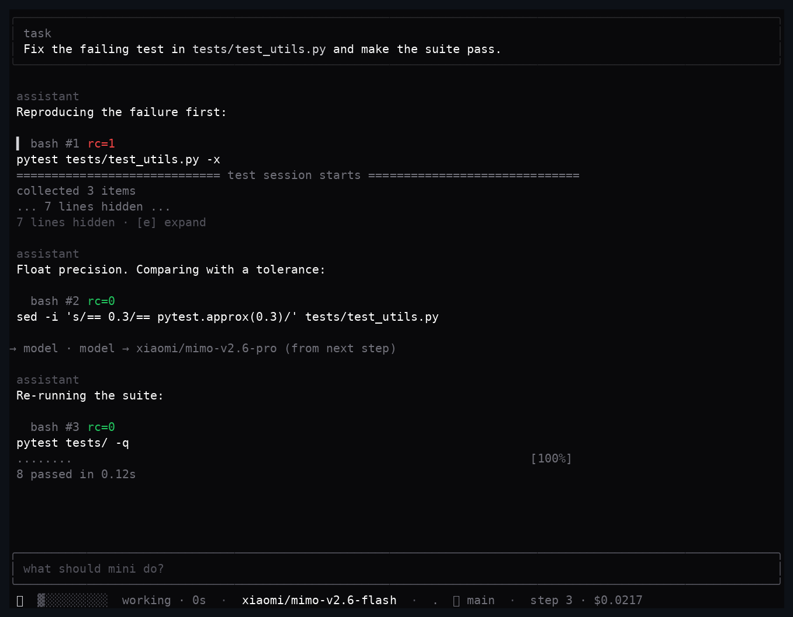 | 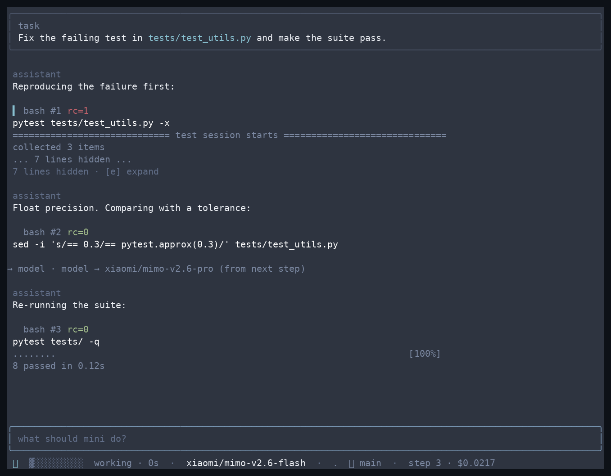 | 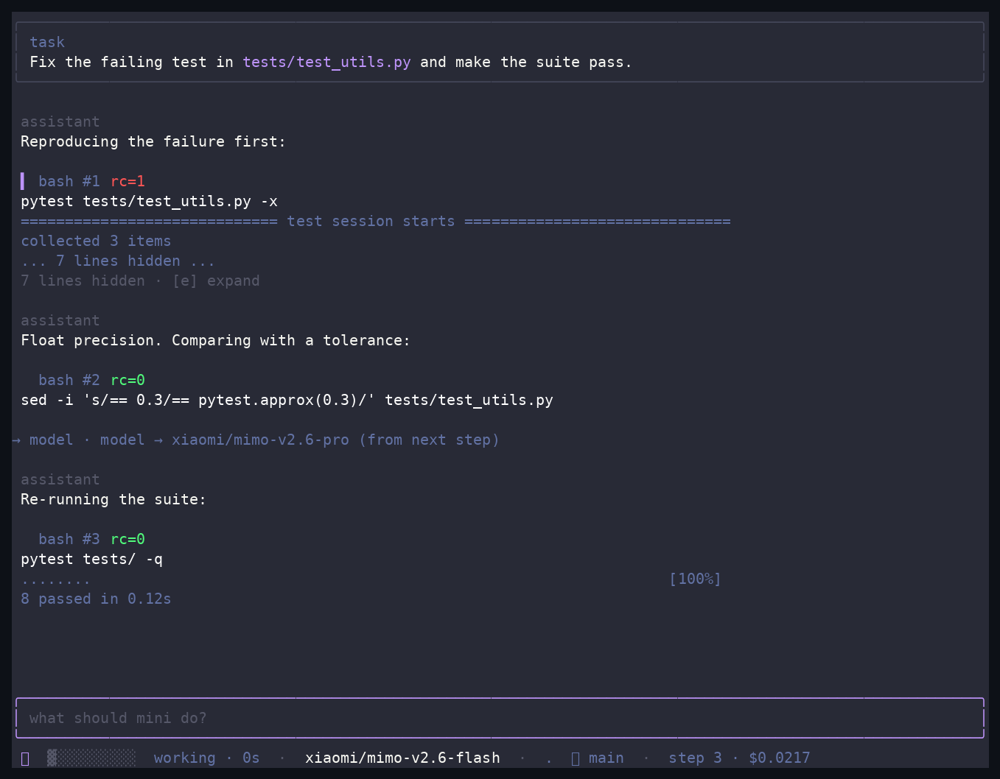 |

| gruvbox | tokyo night | catppuccin |
| --- | --- | --- |
| 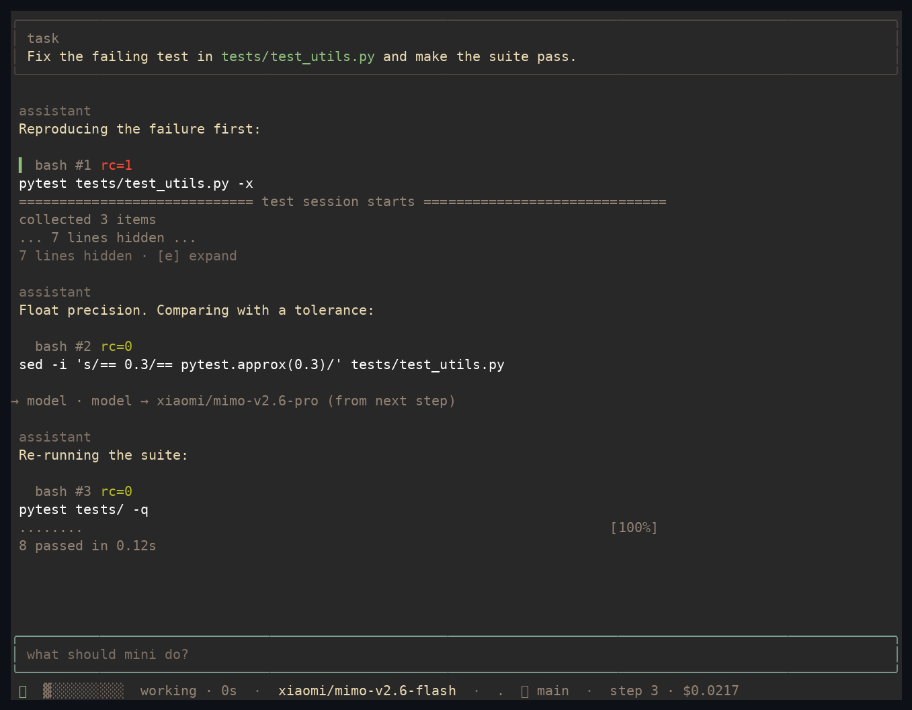 | 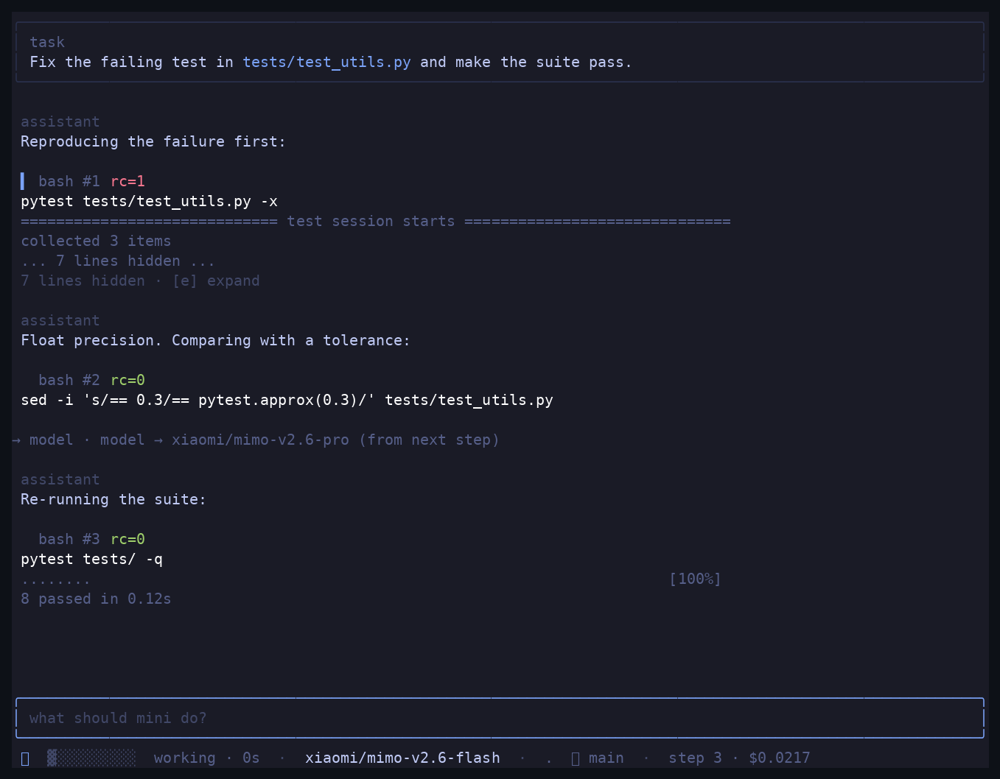 | 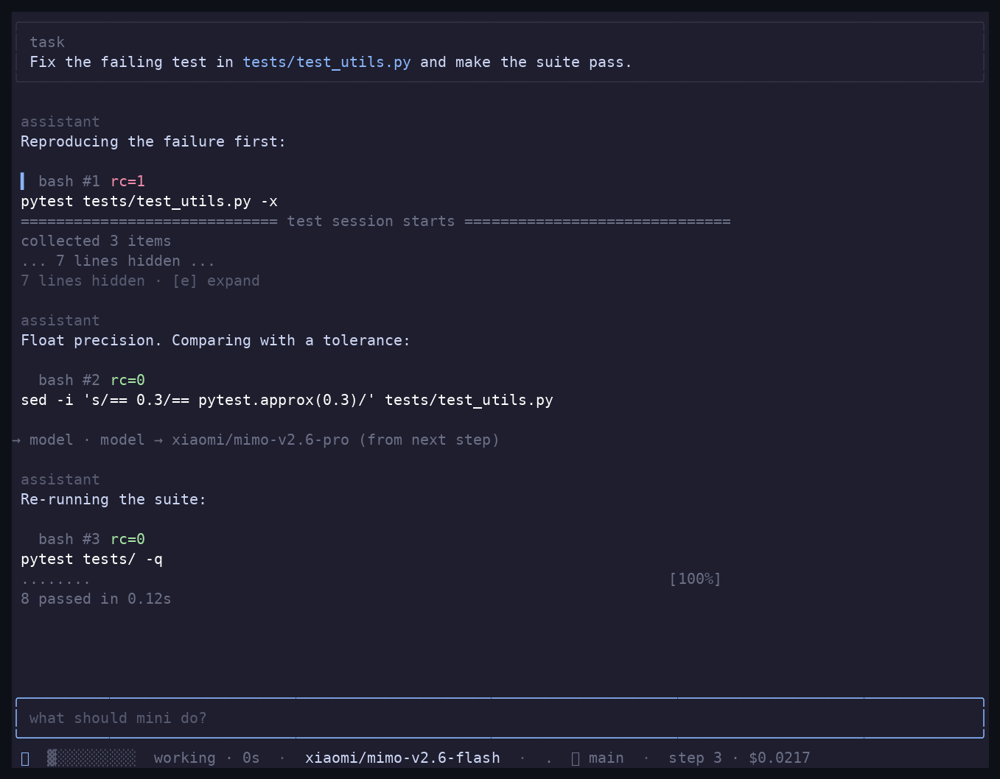 |

## Requirements

- [Bun](https://bun.sh) ≥ 1.3 (OpenTUI ships a native Zig renderer; Node ≥ 26.4 also works)
- An agent, one of:
  - Python ≥ 3.10 with the bundled agent installed (`pip install -e ./agent`), or any `mini` on
    your `PATH`;
  - the [Rust agent](#the-rust-agent-optional): no Python needed, either a
    [release binary](https://github.com/jaivial/mini-tui/releases/latest) or `cargo build --release`
    in `agent-rs/`.

  `~/.config/mini-swe-agent/.env` is honored either way.

## Install

```bash
git clone https://github.com/jaivial/mini-tui && cd mini-tui
bun install
python3 -m pip install -e ./agent   # bundled mini-swe-agent → `mini` + `mini-swe-agent-tui`

# optional: make `mini-tui` available everywhere
cp bin/mini-tui ~/.local/bin/mini-tui && chmod +x ~/.local/bin/mini-tui
```

Without Python, download the static Rust agent instead of the `pip install` step. mini-tui finds it
there on its own:

```bash
mkdir -p ~/.local/lib/mini-tui
curl -Lo ~/.local/lib/mini-tui/mini-agent-rs https://github.com/jaivial/mini-tui/releases/latest/download/mini-agent-rs-x86_64-linux-musl
chmod +x ~/.local/lib/mini-tui/mini-agent-rs
```

## Usage

```bash
# Just start it: the prompt bar is ready (like `mini -y -m <model>`, but pretty)
mini-tui
mini-tui -m xiaomi/mimo-v2.6-flash

# Or start immediately with a task
mini-tui run "Fix the failing test in test_utils.py" -m xiaomi/mimo-v2.6-flash

# Render an existing trajectory (add --follow to keep watching it)
mini-tui view ~/.config/mini-swe-agent/last_mini_run.traj.json

# Include the system prompt in the transcript
mini-tui run ... --show-system
```

### Headless: `mini-tui -p` (no TUI)

`-p` / `--print` runs a session with no UI, like `claude -p`, `opencode run` or `pi -p`: the
same integrated agent (tools, `$skills`, `/connect` providers, follow-up context) runs one turn,
the answer goes to stdout, and the process exits with the run's status. Scripts, CI jobs, cron
and other agents can drive mini-tui this way.

```bash
# Only the final answer on stdout (quiet by default)
mini-tui -p "Fix the failing test in test_utils.py" -m xiaomi/mimo-v2.6-flash

# Verbose: every step (commands, outputs, notices) streams to stderr, the answer to stdout
mini-tui -p "why is the build red?" -v

# Machine-readable: one JSON result, or JSON lines as the run happens
mini-tui -p "list the TODOs" --json | jq -r .result
mini-tui -p "refactor utils.py" -o stream-json | jq -c 'select(.type=="tool_call")'

# Pipe context in (stdin is appended to the prompt, or is the prompt)
git diff | mini-tui -p "review this diff"

# Sessions continue exactly like /resume in the TUI
mini-tui -p "now add tests" --continue          # latest session of this folder
mini-tui -p "and the docs" --resume s-mugx      # any session, id or unique prefix
mini-tui -p --compact --continue                # /compact from the shell

# Guard rails for unattended runs
mini-tui -p "..." --max-steps 30 --cost-limit 1 --timeout 900 --cwd ~/repo --no-session
```

| Option | Meaning |
|---|---|
| `-m, --model <id>` | model of this run (default: `$MINITUI_MODEL`, the resumed session's model, else the last `/model` pick) |
| `-o, --output-format` | `text` (default) · `json` · `stream-json` (`--json` = `-o json`) |
| `-v, --verbose` | stream every step: text → stderr; json → adds `events`; stream-json → thinking and full outputs |
| `-q, --quiet` | the answer only: no error tail on stderr |
| `-C, --continue` / `-r, --resume <id>` | follow up in the latest / a given saved session |
| `--compact` | compact a `--continue`/`--resume` session instead of sending a prompt |
| `--no-session` | don't save the run to the `/resume` history |
| `--cwd <dir>` | working directory of the run |
| `--max-steps`, `--cost-limit`, `--timeout` | `agent.step_limit`, `agent.cost_limit`, `agent.wall_time_limit_seconds` |
| `-c, --config <spec>` | extra mini config (`key=value` specs merge into the default config) |

Exit codes: `0` submitted, `1` the run failed or hit a limit, `2` usage error, `130`
interrupted (Ctrl+C / SIGINT once interrupts the agent, twice kills it).

The `json` result (also the last `stream-json` line) carries `result`, `subtype`
(`success`/`error`/`interrupted`), `is_error`, `exit_status`, `session_id`, `model`, `cwd`,
`num_steps`, `api_calls`, `cost_usd`, `duration_ms`, `trajectory_path`, `log_path` and, on
failure, `error`. `stream-json` starts with an `init` line (session id, model, runner, paths),
then one line per transcript event (`task`, `assistant`, `tool_call`, `observation`, `notice`,
`exit`, and `thinking` with `-v`).

### Scripting commands

Everything the TUI's slash commands do also works from a shell (add `--json` to any of them):

```bash
mini-tui sessions [--all] [-n 20] [-s text]   # /resume history (this folder, or all)
mini-tui sessions show <id>                   # print a transcript
mini-tui sessions rm <id>                     # delete a session
mini-tui models                               # /model catalog + /connect providers (* = default)
mini-tui model [<id>]                         # print / set the default model (what /model saves)
mini-tui skills                               # $skills
mini-tui settings [output-mode|theme <value>] # /settings
mini-tui --version
```

Run artifacts live under `~/.config/mini-tui/runs/<timestamp>-<slug>/`
(`traj.json` + its append-only `traj.jsonl` journal, `mini.log`, `pid`, `control`). mini-tui never
touches `~/.config/mini-swe-agent/last_mini_run.traj.json` — it always passes its own `-o`.

## Keys

| Key | Action |
| --- | --- |
| `Enter` | send the prompt (starts a task, or continues the running conversation) |
| `Alt+Enter` / `Ctrl+J` | insert a newline in the prompt (`Shift+Enter` too where the terminal reports it) |
| `/` | opens the command palette: `↑`/`↓` or click to select · `Enter`/`Tab` fills the prompt (never sends) |
| `$` | anywhere in the prompt: opens the skills panel (filters as you type) · `Enter`/`Tab` inserts `$name` |
| `/compact` | summarize the conversation now (frees context) |
| `/subagents` | list the subagents this session started (each is a session: `/resume` opens it) |
| `↑` / `↓` (in the prompt) | browse the prompts sent in this session · `↓` past the newest restores your draft |
| `Esc` | close the palette / leave the prompt · **double `Esc` interrupts the run** |
| `ctrl+c` | clear the prompt · press it twice (within 1.5 s) to close |
| `ctrl+\` | show / hide the error console (`Esc` closes it) |
| `/quit` · `/exit` | close mini-tui |
| `/help` | commands and keys |
| `/model` | open the model picker (or `/model <id>` for a direct switch) |
| `/settings` | output display (collapsed / trimmed / expanded) |
| `/new` | start a fresh session in place (stops the current run; model and settings stay) |
| `/resume` | browse sessions saved in this folder (search + pages, `→` previews a transcript read-only) |
| `/connect` | connect a BYOK provider (key → model → tested connection) |
| `j` / `k` (or ↓ / ↑) | (navigation mode) move between tool call blocks |
| `e` | expand / collapse the focused output block |
| `PgUp` / `PgDn` | scroll half a screen · mouse wheel scrolls 3–5× (burst-accelerated) |
| `g` / `G` | load older steps (viewport-sized pages) / back to the live bottom |

## How it works

```
mini-tui run
  ├─ src/mini/spawn.ts   starts `mini-swe-agent-tui` (or falls back to `mini`)
  │                      raw stdout/stderr → <session>/mini.log
  ├─ src/traj/watch.ts   polls <session>/traj.json every 200 ms (rewritten by the harness per step)
  ├─ src/traj/parse.ts   pure parser: messages → RunEvent[] (tools, outputs, notices, exit)
  └─ src/ui/             OpenTUI + React renderer (cards, badges, banners, prompt, /model picker)
```

The parser tolerates mid-write reads (the harness rewrites the file non-atomically after every
step), unknown message shapes, and multimodal content in any of the message formats mini produces.

### Follow-ups and `/model` under the hood

mini-tui appends `MESSAGE <text>` / `MODEL <id>` lines to the run's control file
(`<session>/control`, exported to `mini` as `MSWEA_CONTROL_FILE`). The companion harness patch:

- injects `MESSAGE` lines as `UserNewTask` prompts — from the agent's next step mid-run, and after
  a submission via an *exit hold* (the run stays open so one conversation can span many turns);
- applies `MODEL` switches from the next step.

### One agent, several UIs

Each UI that starts an agent records it in the `live_runs` table of `sessions.db` (session,
trajectory, control file, pid). Another UI opening that session checks that the pid still runs that
trajectory, then follows it the same way: it reads the same journal and writes to the same control
file. So the web app, the terminal and a subagent's parent all drive one process, and whichever UI
started it decides when it ends.

## The Rust agent (optional)

`agent-rs/` is a Rust port of the bundled agent's runner. It uses the same command line, configs,
trajectory, journal and control file, packaged as one self-contained binary.

| | Python agent | Rust agent |
| --- | --- | --- |
| Start a run | ~190 ms | ~2 ms |
| A session waiting for your next message | ~36 MB | ~4 MB |
| Needs | Python ≥ 3.10 + the agent's packages | nothing (static build: any x86-64 Linux) |

```sh
cd agent-rs && cargo build --release      # or: --target x86_64-unknown-linux-musl (static)
mini-tui                                  # uses it: Rust is the default once the binary is there
MINITUI_AGENT=python mini-tui             # the Python agent instead
```

Prebuilt binaries (`mini-agent-rs-x86_64-linux-musl`, `…-linux-gnu`, `SHA256SUMS`) are attached to
every [release](https://github.com/jaivial/mini-tui/releases/latest).

**Does the Rust agent use more tool calls, or take longer?** No. Both agents send the model
byte-identical prompts, so the model batches commands into replies exactly the same way and neither
one makes it do more work. Two parity scenarios lock that in: `turns` (a model that batches several
commands per reply must produce the same turns, tool calls and trajectory on both) and
`batch-calls` (the same over the wire, with every request body compared byte for byte). The Rust
agent also gets to its first model request sooner (~7 ms vs ~173 ms). If two runs of the same task
really do differ, the difference is on the model side — sampling and context pressure decide how
much a model batches per reply — and not in the runner.

**Rust is the default** for the terminal UI, `mini-tui -p` and the web app, whenever the binary is found:
`MINITUI_AGENT_BIN`, else `agent-rs/target/release/mini-agent-rs`, else `~/.local/lib/mini-tui/mini-agent-rs`,
else `mini-agent-rs` on `PATH`. The binary also generates session titles and runs the providers panel's
connection tests, so nothing runs through Python. Without a binary, mini-tui uses the Python agent as
before; `MINITUI_AGENT=python` chooses it on purpose, and `MINITUI_AGENT=rust` says so when the binary is
missing. mini-tui points the binary at the bundled YAML configs (`MINI_AGENT_CONFIG_DIR`), so a copy
installed outside the checkout works too.

It covers everything mini-tui uses:
- **The loop:** limits, follow-ups, `/model`, `/compact` and automatic compaction, `--resume`,
  interrupts.
- **Models:** cli-proxy, Rosetta, DeepSeek, Xiaomi, OpenAI, Anthropic, the provider registry and
  OpenCode Go.
- **Environments:** local and docker.

`agent-rs/tests/parity/run_all.sh` runs both agents on the same scripted tasks and scripted HTTP
servers: 31 scenarios plus 8 helper cases. It checks that they write identical trajectories, exit the
same way and send identical requests. See [`agent-rs/README.md`](agent-rs/README.md) for what is and
is not ported.

### Subagents

A session on the Rust agent can split its work across **subagents it owns**. The model drives them
from its bash tool, and the bundled `$subagents` skill teaches it how:

```sh
mini-agent-rs agent spawn api "write the API tests" --cwd ~/repo --max-steps 60
mini-agent-rs agent send api "also cover the 404 path"   # mid-run, or continue a finished one
mini-agent-rs agent resources              # free memory, avg child cost, how many more may start
mini-agent-rs agent ls | wait | result | tail | model | stop
mini-agent-rs agent ask "which branch?"                   # inside a subagent: ask the parent
```

- **One process per subagent.** It keeps its whole context between turns, so a follow-up is a
  single message, not a new run replaying the history. A message sent mid-run lands before its next
  step. One that exited continues from its saved conversation under the same name.
- **It reports back by itself.** When a subagent finishes, fails, stalls or asks something, the
  parent reads a `[subagent <name>] …` message before its next step. A parent that already ended
  its turn is woken by it, so the orchestrator never spends steps polling.
- **Owned by the session.** Subagents stop with it, count toward its cost limit, and run on its
  current model unless told otherwise. Up to 100 run at once, nested at most 2 deep.
- **It never OOMs the box.** Before you fan out, `agent resources` reports the free memory, the
  **measured average memory of the running subagents**, and `max fan-out now`:
  `min((free - 10 GiB reserve) / average child, CPU headroom, 100 - live)`. Every `spawn` runs the
  same calculation at the gate, so a child that would not fit is refused — the session, and every
  other child, keeps running.
- **Visible everywhere.** Each subagent is saved as a session under its parent: the web app shows
  them above the transcript, the TUI lists them with `/subagents`, and any of them opens live.
- **Your connected models, no extra key.** A subagent on another model (`-m minimax/...`) gets that
  model's key from your `/connect` providers (`~/.config/mini-tui/providers.json`), like a run you
  start yourself. Nothing has to be exported first. A variable you did set still wins.
- **The parent reviews before it accepts.** A subagent's summary is a claim. The `$subagents`
  skill has the parent check the diff, the build and the tests itself. When something is missing or
  wrong, the parent sends the review back to that same subagent (`agent send <name> "<review>"`):
  each finding with its file and line, and the check to rerun. The subagent fixes the work with all
  its context, and the parent reviews again until nothing is left. After 3 rounds stuck on one
  finding it moves that subagent to a stronger model (`agent model`).

A run that starts no subagent behaves exactly like the Python agent: the parity suite still
compares every scenario byte for byte. `$orchestration`'s `orch` forwards its commands to the
session's subagents when it runs inside a Rust session. Its detached headless runs remain for your
own terminal and the Python agent. Full reference: [`agent-rs/README.md`](agent-rs/README.md#subagents-mini-agent-rs-agent).

## Bundled mini-swe-agent

`agent/` vendors [mini-swe-agent](https://github.com/SWE-agent/mini-swe-agent) (v2.4.6 base via
`git subtree --squash`) together with everything mini-tui's nicest behaviors need, so
`pip install -e ./agent` is one install that carries:

0. **Integrated runner** — `mini-swe-agent-tui` shares the public CLI's config merge, model loop,
   journal, resume format, and `MSWEA_CONTROL_FILE` protocol, but skips Typer, Rich, prompt
   interaction, and the interactive-agent module on the normal yolo path. `mini-tui` probes for
   it once; `MINITUI_EMBEDDED_AGENT=0` forces the compatible `mini` CLI fallback.
1. **Plain-text final answer** — a response with text and no tool calls is the submission
   (no more `cat > /tmp/final_answer.md` round-trips).
2. **Control file** — `MODEL <id>` switches the running agent's model from its next step;
   `MESSAGE <text>` continues the conversation mid-run or at the exit hold (both no-ops when
   `MSWEA_CONTROL_FILE` is unset).
3. **`--resume`** — reloads a previous conversation's message history as context and treats
   the new task as a follow-up (what `/resume` + prompt uses).
4. **Custom model providers** — xiaomi (MiMo), rosetta, cliproxy, deepseek, opencode_go and
   openai model classes, with `mini extra <provider>-models` to list their catalogs.
5. **Append-only trajectory journal** — `<traj>.jsonl` gets one line per message (O(1) per
   step, never torn) and the full `traj.json` export is compact, atomic and throttled;
   mini-tui reads the journal and parses only the new bytes per tick.
6. **Slim default install** — the direct HTTP clients do not need the `openai` SDK; benchmark
   datasets live behind the `benchmarks` extra (`mini-swe-agent[full]` includes it).

Upstream sync: `git subtree pull --prefix=agent --squash <upstream> <ref>`. The original patch
descriptions (kept for upstreaming) live in
[docs/mini-swe-agent-patches.md](docs/mini-swe-agent-patches.md).

## Performance

Trajectory persistence, measured on a synthetic 300-step run (the agent saves after every step):

| | full rewrite per step (old) | append-only journal + throttled export (now) |
| --- | --- | --- |
| Bytes written | 235.4 MB | 4.3 MB (**55× less**) |
| Persistence time | 0.99 s | 0.12 s (**8× faster**) |

The TUI itself is bounded and lean: the transcript mounts a viewport-sized sliding window
(two viewports, 24–120 items depending on terminal height), so memory stays flat no matter how long
a run gets; `g` pages older items in and `G` returns to the live bottom. The 0.3.0 render pass then
cut the measured footprint by ~30 % across the board — on the standard 400-step repro: 18.6 s →
13.1 s CPU and peak RSS 323 → 228 MB. In 0.5.0 blocks got 3.6× leaner (plain text unless the
text really has markdown — measured 0.33 → 0.09 MB per block): the same repro now settles at
205 MB, and a plain-prose run at 152 MB. Agent-side, `prompt_toolkit` loads lazily (35 → 20 MB
import). In 0.7.0 the local/subscription gateways (`cliproxy/`, `rosetta/`, `xiaomi/`) talk to
their OpenAI-compatible endpoint directly instead of through `litellm`: a real claude-opus-5-5 run
peaks at **40 MB instead of 214 MB** and answers ~2.3 s sooner. Since 0.9.0 every provider
(DeepSeek, OpenAI, Anthropic, OpenCode Go included) talks to its base URL directly and litellm is
an optional extra ([docs/PLAN-litellm-detach.md](docs/PLAN-litellm-detach.md)).

**0.13.0 integrated-runner benchmark** (`scripts/benchmark-runtime.py`, seven fresh Python 3.10
processes, deterministic one-step run, no network): public `mini` **~205–212 ms / ~39 MiB peak RSS**;
bundled `mini-swe-agent-tui` **~160–170 ms / ~34 MiB** — about **20% faster and roughly 5 MiB less resident
memory**. The measurement excludes the TUI process itself; it covers the agent startup/run path
that the TUI launches. Run `python3 scripts/benchmark-runtime.py --runs 7` to reproduce.

The TUI ingestion path has its own terminal-free benchmark: `bun run benchmark:tui -- 5000`
appends 10,002 realistic trajectory messages and measures only the incremental parser (about
**11–12 ms** on the current machine). The randomized item-index tests cover tool/observation pairing
fallbacks and prefix replacement, so long-run CPU growth is measurable without opening a TTY.

See [docs/PLAN-ram-reduction.md](docs/PLAN-ram-reduction.md) for the plan and numbers.

## Development

```bash
bun test          # parser fixtures + in-memory OpenTUI render tests (no TTY, no network)
bun run typecheck
bun run screenshots   # regenerates docs/screenshots/*.png from scripted scenes
bun run benchmark:tui -- 5000   # terminal-free long-run parser + item-index benchmark
MINITUI_AGENT=python bun test   # the same suite on the Python agent (Rust when its binary is built)

cd web && bun run e2e           # the web app in a real browser (see web/README.md for the others)
cd web && bun run build && bun scripts/bundle-report.mjs   # chunk sizes, and what a cold visit downloads
cd agent-rs && cargo test --release && sh tests/parity/run_all.sh   # Rust agent: unit + parity
```

## Notes and known limits

- Yolo only: runs use the integrated agent entry (or the compatible `mini -y --exit-immediately`
  fallback) — the UI visualizes and forwards prompts, it never confirms or rejects commands.
- No token streaming in the terminal UI: the transcript updates once per step, so the spinner covers
  model calls and command execution. The web app shows the reply as it streams. Follow-ups sent
  mid-step are picked up at the next step.
- After a submission the run stays open ("type to continue") while the TUI is attached; quitting
  the TUI ends it.
- The code highlighter degrades to plain text when a tree-sitter grammar is unavailable.
- If the TUI is killed hard, the agent child may survive: check `<session>/pid` and
  `pgrep -af "minisweagent.run.tui|mini-agent-rs|mini -y --exit-immediately"`.
